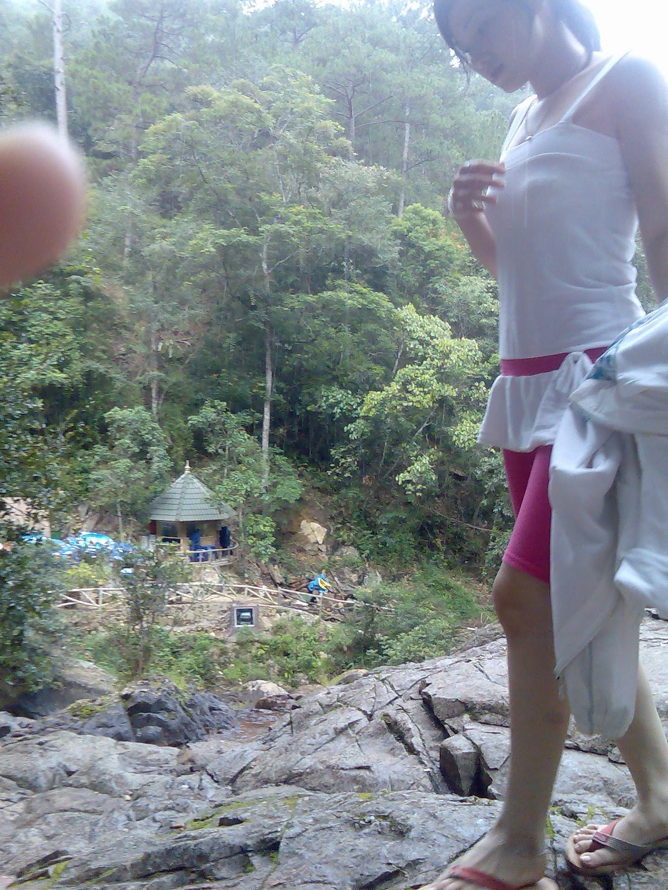

# Saul - Gai Thai

<!-- toc -->

- [Gioi thieu](#gioi-thieu)
  * [Chuyen tinh cam cua toi](#chuyen-tinh-cam-cua-toi)
    + [Ngoai truyen - Chuyen tinh cam cua toi - p1](#ngoai-truyen---chuyen-tinh-cam-cua-toi---p1)
    + [Ngoai truyen - Chuyen tinh cam cua toi - p2](#ngoai-truyen---chuyen-tinh-cam-cua-toi---p2)
    + [Ngoai truyen - Chuyen tinh cam cua toi - p3](#ngoai-truyen---chuyen-tinh-cam-cua-toi---p3)
    + [Ngoai truyen - Chuyen tinh cam cua toi - p4](#ngoai-truyen---chuyen-tinh-cam-cua-toi---p4)
- [Chap 1 - Vao de](#chap-1---vao-de)
  * [Ngoai truyen - Minh khong phai natuan dau](#ngoai-truyen---minh-khong-phai-natuan-dau)
- [Nha co be](#nha-co-be)
- [Doi song tinh duc cua chung toi](#doi-song-tinh-duc-cua-chung-toi)
- [Loi de nghi ky la](#loi-de-nghi-ky-la)
  * [Ngoai truyen - Ham rang cua em no](#ngoai-truyen---ham-rang-cua-em-no)
- [Chuyen di](#chuyen-di)
- [Nguoi cau](#nguoi-cau)
- [Mam co](#mam-co)
- [Thay cung va lan tro chuyen dau tien](#thay-cung-va-lan-tro-chuyen-dau-tien)
  * [Ngoai truyen - Vi sao bai viet lau len](#ngoai-truyen---vi-sao-bai-viet-lau-len)
- [Binh minh](#binh-minh)
  * [Ngoai truyen - Vi sao toi viet truyen nay](#ngoai-truyen---vi-sao-toi-viet-truyen-nay)
- [Cho huyen](#cho-huyen)
  * [Ngoai truyen - Vi sao toi viet truyen nay](#ngoai-truyen---vi-sao-toi-viet-truyen-nay-1)
- [Duong ve](#duong-ve)
- [Em oi la em](#em-oi-la-em)
  * [Vi sao toi viet truyen nay](#vi-sao-toi-viet-truyen-nay)
  * [Vi sao toi viet truyen nay](#vi-sao-toi-viet-truyen-nay-1)
- [O khach san](#o-khach-san)
- [Ban cu](#ban-cu)
- [Lam toc](#lam-toc)

<!-- tocstop -->

## Gioi thieu

### Chuyen tinh cam cua toi

#### [Ngoai truyen - Chuyen tinh cam cua toi - p1](https://vozforums.com/showthread.php?p=134444253#post134444253)

Như tôi, yêu nhau được 2 năm. Cũng đã tính em nó ra trường là tính chuyện hôn nhân. Hôm đấy đang ở công trình, thế nào anh em công nhân nó bắt được 1 mớ lươn đồng. Biết em nó thích ăn, lái xe thẳng về Hà Nội tính làm cho ăn, tạo bất ngờ nên ko gọi điện trước. Hý hửng xách lên phòng trọ nó, thì thấy nó đang ngồi ăn tối với 1 thằng. Em nó giật mình xong giới thiệu đây là thầy hướng dẫn luận văn của em, qua hướng dẫn giúp em mấy thứ. Mình nhìn lướt qua thấy nó không mặc áo ngực, ném mẹ mớ lươn vào giữa bàn ăn của tụi nó tung tóe cả rồi đi về. Xong chặn điện thoại, chặn yahoo, chặn mail. Từ đó không liên lạc nữa. Mãi 7 năm sau kỷ niệm ngày thành lập trường cấp 3 mới gặp lại, nó nhìn thấy mình cái là quay đi khóc nức nở, trong khi chồng nó đứng ngay đó.

#### [Ngoai truyen - Chuyen tinh cam cua toi - p2](https://vozforums.com/showpost.php?p=134446497&postcount=111)
Chồng em nó chính là thằng thầy hướng dẫn hôm đó, học hơn mình 2 khóa, thấy mình cũng tránh mặt. Hai đứa sau vụ đó 5 tháng thì cưới nhau. Nói gì thì nói, giảng viên đại học thời đó có giá lắm, dù ko nhiều tiền như tụi dân công trình, kỹ thuật như mình. Theo như tìm hiểu thì hai vợ chồng đang có 1 đứa con, ở cái chung cư mini 30m2 khu Xuân Thủy, chồng vẫn đi dạy, vợ dạy hợp đồng cho mấy lớp tại chức, còn chủ yếu bán hàng online tăng thu nhập. Giờ nhìn em ấy thấy tất bật lo toan cuộc sống, nhan sắc phai nhạt, mình thấy thương cảm sao ấy. Giá mà ngày đó em nó không thế, thì có lẽ giờ mình đã không phải lận đận đường tình cảm, mà em nó không lận đận cuộc sống.

#### [Ngoai truyen - Chuyen tinh cam cua toi - p3](https://vozforums.com/showpost.php?p=134448457&postcount=117)
> Originally Posted by aegon_targaryen  View Post

> Lòng dạ đàn bà.  tôi thì yêu nhau cũng 8 9 năm chứ ít gì. Không còn tình thì chí ít cũng có cái nghĩa. Rốt cục đéo đâu vào đâu cả

> Sent from my iPhone using vozForums

Yêu 8 -9 năm mà ko cưới thì khó thành lắm. Mà thôi, đời là trải nghiệm, trải nghiệm tình yêu với nhiều người cũng hay, cũng là 1 cách để hiểu đời hiểu người và hoàn thiện bản thân mình hơn.

#### [Ngoai truyen - Chuyen tinh cam cua toi - p4](https://vozforums.com/showpost.php?p=134448597&postcount=118)
> Originally Posted by mr_x13  View Post

> Đời người cũng muôn màu muôn vẻ thật.Chúc bác gặp được cô gái biết trân trọng,yêu thương bác vô điều kiện.Chúc bác may mắn.

Cám ơn bác, chắc chỉ có mẹ mình mới yêu thương mình vô điều kiện thôi bác. Giờ thì mình chỉ tìm 1 cô gái hợp với mình và gia đình mình để cùng nhau xây dựng hạnh phúc thôi.

## [Chap 1 - Vao de](https://vozforums.com/showpost.php?p=141610245&postcount=292)

Cái chuyện của anh ko hiếm, bản thân tôi cũng từng có 1 em giúp việc kiểu như thế. Cách đây 3 năm, khi công ty nhà tôi nhận 1 gói thầu nhỏ ở thủy điện Đạ Dâng, Lâm Đồng. Tôi khi đó ở Hà Nội đang gặp chuyện buồn chán, nên xung phong vào phụ trách công trường luôn. Công ty tôi nhận đào đắp 1 phân nhánh lòng hồ nơi xa nhất, biệt lập nhất, và đặc biệt mùa mưa thì phải tăng bo cano mới ra được. Ở đây đã có sẵn 1 ngôi nhà xây giữa hồ của đội khảo sát ngày xưa đã đầy đủ điện mặt trời và máy lọc nước, muốn ra vào phải có thuyền, thấy biệt lập lại đẹp tôi dùng luôn làm chỗ ở cho tôi và văn phòng công ty, còn anh em công nhân công ty thì ở phía ngoài bãi xe công trình, cách đó vài trăm mét. Thấy anh em làm việc vất vả quá, về lại phải nấu ăn, giặt giũ nên tôi thuê 1 bà trung trung tuổi đang làm phụ hồ của công trình bên cạnh về giặt giũ nấu ăn. Tất nhiên bà ấy rất sướng, vì việc nhẹ mà lương ko giảm. Những lúc rượu say vui chuyện hỏi ra, thì bà bảo bà là người Thái, hồi trẻ làm vợ lẽ cho 1 tay buôn thuốc phiện ở Mai Châu Hòa Bình. Sau chồng bà bị giết chết bên Lào, việc làm ăn do nhà vợ cả thâu tóm quản lý lại, mụ vợ cả quay ra đánh ghen. Bà sợ, 1 hôm trốn theo gã lái xe tải vào tận Lâm Đồng. Tại đây nó giúp bà mở 1 quán cà phê ngoài Đức Trọng, ăn ở với nhau như vợ chồng có 1 đứa con gái. Tưởng yên ấm thì tay chồng hờ vỡ nợ bị siết cả xe tải, cả quán cà phê, còn nó trốn ra Bắc về lại với vợ con ngoài đó. Bà mang con ra ngoài thuê 1 phòng trọ, bán dâm cho tụi xe tải kiếm tiền sống qua ngày. Một lần từ nhà vệ sinh đi ra thấy thằng khách đang sờ soạn con bé đang ngủ ở võng. Bà sợ quá, gửi con gái về Hòa Bình cho ông bà ngoại chăm. Thôi mệt quá, hôm nào rảnh viết tiếp, có mấy cái ảnh khu công trường cho vui :

Đây là nhà văn phòng tôi ở:

Ra vào khu công trình chỗ tôi phải đi như này :

Công trường :

Ảnh nhân vật chính, kiếm mãi mới có cái đi chơi thác Prenn với em nó :

### [Ngoai truyen - Minh khong phai natuan dau](https://vozforums.com/showpost.php?p=141481357&postcount=35)

> Originally Posted by uhancomroi  View Post

> Đức, chưa tới cao trào mà đã dưng rồi. Được cái em kia cũng ngon

Ra được thì ông cứ ra luôn đi, thế nào tý nữa cũng có mấy con bệnh vào sủa :" Natuan, natuan" thế là tôi hết mẹ hứng, quit luôn. Tôi kể khá nhiều chuyện đời tôi trên này rồi, mà có chuyện nào viết đầy đủ được đâu.

## [Nha co be](https://vozforums.com/showpost.php?p=141511629&postcount=68)
Sau khi con gái về ông bà ngoai, bà đẩy mạnh việc làm ăn,rủ thêm 1 con bé chồng bỏ cùng làm. Suốt mấy năm trời cày cuốc, những tưởng kiếm được cái vốn to thì giải nghệ, mua mảnh đất, mở hàng tạp hóa rồi đón con gái vào. Ai ngờ đâu, nghe con bé kia, hai chị em có bao nhiêu ném vào hụi lấy lời. Được vài tua thì hụi bể, tiền mất. Con kia gần hóa điên lên chùa ở, còn bà lại cắn răng cày cuốc. Nhưng thời thế đã thay đổi, không còn trẻ trung nữa, bán dâm tiền thì ít, lại bị công an và xã hội đen nhảy vào bảo kê thu phế lớn. Đất Đức Trọng lên giá vù vù, tiền thuê nhà theo đó tăng theo. Đến khi cảm thấy làm ko còn đủ đóng phế và thuê nhà nữa, bà bỏ đi làm phụ hồ theo các công trình. Ngày thì trộn vữa, đêm thì bán dâm cho tụi thợ xây, lấy 50 -100k. Lại không mất tiền ăn ở, trừ chi tiêu các thứ tháng cũng để ra được 3-4 triệu. Làm được mấy tháng thì tết, dư hơn chục triệu, bà nhớ con nên tết đó về quê. Về đến nơi mới hay tin con gái, lúc này đã 16 tuổi sắp bị gả bán cho người ta. Nguyên do là thế này, con bé về ngoại được mấy năm thì ông bà ngoại lần lượt qua đời, phải ở cùng vợ chồng nhà cậu ruột. Ông cậu rượu chè cờ bạc nợ người ta 60 triệu, chủ nợ đến đòi, thấy ko còn gì đáng giá ngoài đứa cháu gái đến tuổi lấy chồng, nên bắt thằng cậu làm giấy nhận đứa cháu làm con nuôi. Tập tục của người Thái, sính lễ nhà trai rất bạc, nhưng con gái về nhà chồng thì phải có của hồi môn rất nhiều. Thành ra dù ghét nhau nhưng con gái Thái nhà nghèo vẫn bị buộc phải lấy con trai người Mông. Vì người Mông thì ngược lại, sính lễ để cưới được vợ phải rất hậu, có khi lên tới 2-3 con trâu. Chủ nợ nhận đứa cháu làm con nuôi để được toàn quyền ép gả cho 1 gia đình người Mông giàu có và nhận sính lễ đặng mà trừ khoản nợ của thằng cậu. Bà về thấy con gái mình vậy quyết không chịu, vì những người dân tộc đã thoát ly khỏi bản làng rồi, chẳng muốn con cái mình phải quay về nơi đấy. Nhưng không thể làm gì được, thằng cậu lấy cớ công nuôi cháu bao năm giờ nó phải có quyền gả bán, nếu không phải trả nó tiền nuôi dậy. Tiền thì đâu ra? bà mua cho con gái chỉ vàng dặn khâu dưới vạt áo, sau này cần thì dùng rồi lủi thủi về laị Lâm Đồng, dạt về công trình hồ thủy điện Đạ Dâng và làm cho tôi như phần trên đã nói.
Đây nhà thằng cậu của em nó, mà tôi phải ra tận nơi, vào tận bản chồng đủ 65 triệu + 5 triệu làm mấy mâm cơm cúng con ma nhà nó, mời thằng thầy mo đến hít thuốc phiện và múa hương quanh đầu. Đm, nhà nghèo kiết xác.

## [Doi song tinh duc cua chung toi](https://vozforums.com/showpost.php?p=141516469&postcount=77)
Qua câu chuyện của bà kia thì chắc các bác cũng biết bà ấy ko chỉ làm tạp vụ bình thường ở công trường của tôi. Đúng như các bác nghĩ đấy. Bà ấy làm được mấy hôm thì thấy tụi công nhân vác gỗ, vác tôn hò nhau làm 1 cái nhà kho. Tôi hỏi thì chúng nó bảo, tụi em làm cái nhà kho để dụng cụ, phi dầu tránh nắng mưa. Con bà chúng mày, tự nhiên ý thức trách nhiệm thế, mọi khi hò rát cổ dụng cụ xe nào để về xe đấy mà chúng nó còn đéo nghe, mà nhà kho đéo gì lại có cái phản gỗ với cái đệm 1m2. Y như rằng đêm đéo nào cũng lục cục ở đó, có hôm vào tìm cái mắt xích máy xúc, thấy bao cao su vất đầy gầm phản. Thôi thì con trai mà, cho chúng nó xả. Nhưng điều bất ngờ nhất là thằng kỹ sư trắc địa, trẻ đẹp trai, lương ngàn đô cũng tuần 2 cữ hì hục với bà ấy. Mà sau này còn biết mỗi cữ nó phải 2 shot mới về lán ngủ. Các anh sẽ có câu hỏi, bà ấy thế nào mà thằng kỹ sư tri thức kia đéo đơn thuần chỉ để xả, 2 shots cơ mà, đm đấy là thưởng thức đấy chứ. Vâng, gọi là bà thôi nhưng thật ra gọi là chị thì chuẩn hơn vì bà ấy mới có 37 tuổi, dân lao động nên vẫn săn gọn, mặt ko xinh không xấu, lại trắng hồng hào. Nếu so với đám máy bay mà tụi thiên địa vẫn tung hô là thánh nữ thì vượt xa, kiểu thế nào nhỉ, các ông có nhớ con thần dâm Hoài Ngựa 1 thời không, bà này là phiên bản già hơn và quê hơn 1 tý. Tất nhiên các ông sẽ lại có câu hỏi nữa, tôi có chén bà ấy không. Ah, cái này thì không nhé, vì thẩm mỹ tôi cao vãi linh hồn ra, dù lượng Testosterone của tôi cao không kém. Tôi cũng rất thèm gái, nhưng chim tôi có tự trọng và có nguyên tắc, nên nhiều khi thèm quá, trời tối rồi mà tôi vẫn băng đèo lội suối về Đà Lạt tìm chơi gái. Mà tôi cũng nói luôn, khoản gái gú của Đà Lạt như cái con cc, nào là massage Hoàng Châu, Hương Sứ.... toàn là hàng dạt, xấu hình thể còn hay vòi vĩnh. Cave thì toàn cá sấu đội lốt sinh viên, hẹn vào mấy nhà nghỉ khu ngã 5 đại học bẩn như chó. Vâng, tôi đi hết từng đó nơi mà toàn dúi cho 200k tống tiễn chúng nó về, chưa được xả phát nào. May quá, 1 lần đối tác tiếp tôi ở nhà hàng Phú Vang, cả nhà hàng có 2 con ngon nhất, tôi nhớ mỗi con tên là Hà quê Đà Nẵng.Chúng nó vòi vĩnh nũng nụi đủ cả, máu dồn về chim rồi, tôi ra giá 3 củ/1 đêm. CHúng nó nguýt dài mới vl các ông ạ, cắn răng trả 5 củ, tụi nó còn bảo người yêu em ko cho đi qua đêm đâu. Vl thật, đm, 5 củ ở Hà Nội tao có hotgirl tập gym rồi, chứ đéo phải mấy con phục vụ nhà hàng bụng bia được mỗi mặt xinh như chúng mày. Ăn ở đó xong thì rủ chúng nó đi hát Karaoke ở Thủy Mộc gần bên. Lại uống thêm bia, nội tiết tố nam làm tôi mất hết lý trí. Thấy con Hà vào nhà vệ sinh, chắc vào tô lại son vì bị tôi cưỡng hôn lúc nhảy cùng nhau, tôi vào theo ngay cùng. Nó chưa kịp la tôi rút ra 2 triệu và 1 cái bao cao su bảo nó, em chỉ cần tụt quần xuống và cho anh 2 phút. Nó ngần ngừ chút rồi cầm tiền, mẹ, tôi mất chưa đến 1phuts đã xong các ông ạ. Sau lần đó nó thấy tôi chơi đẹp nên đồng ý giá 5 triệu/đêm, nhưng ngay sau đêm đầu tiên tôi đã ngấy mẹ nó cái ngấn mỡ của em nó, gái nhà hàng mà, rượu bia suốt ngày, không bao giờ gặp lại nữa. Đấy lan man như thế để các ông biết tôi khổ sở và tốn kém vì gái gú Đà Lạt lởm khởm như thế nào. Đó cũng là lý do tại sao tôi quyết định phải có 1 hàng thửa ở cái đất này. Và là nhân duyên của tôi và cháu, ah em ấy. Không biết 16 tuổi gọi 31 tuổi là chú hay anh thì hợp nữa, riêng tôi bắt em nó gọi chú xưng cháu cho thêm phần bệnh hoạn.

## [Loi de nghi ky la](https://vozforums.com/showpost.php?p=141528001&postcount=86)
Rồi mùa mưa đến, công việc lập tức bị ngưng trệ, các phương tiện bánh lốp không thể hoạt động. Các phương tiện bánh xích cũng chỉ có thể làm việc buổi sáng, đến chiều cơn mưa kéo tới, nước đổ như trút ko thể làm nổi. Công ty chúng tôi cũng như các công ty khác, rút bớt nhân lực ra khỏi lòng hồ. Khu công trường do tôi quản lý, chỉ còn 1 đội máy xúc 5 người 3 máy cứ tạnh mưa là làm, kể cả đêm. Riêng khối kỹ sư thì tập trung cho công tác nội nghiệp hầu như ở lại. Công việc nhàn hẳn, việc ra vào cũng phải đợi ca nô của ban quản lý, thành ra lại rượu, cứ mưa là rượu. Và trong 1 cuộc rượu như thế, bà ấy đã kể về cuộc đời bà và đứa con gái như vậy. Lúc đó tôi cũng ngà ngà say, xâu chuỗi mọi thứ lại, và quan trọng nhất là được xem ảnh của con gái bà ấy, tự nhiên tôi có 1 ý tưởng như anh chủ thớt này. Ý tưởng mua 1 đứa con gái về phục dịch cho mình như 1 nô lệ thật là bệnh hoạn, nhưng cái gì cũng có hai mặt, việc này mà thành vừa là giúp người, vừa là giúp mình. Tôi tự hứa sẽ đối xử thật tốt với cháu nó, và sẽ lo cho cháu nó có tương lai tươi sáng hơn, thay vì làm vợ 1 thằng người Mông suốt ngày cắm mặt trong bếp, và nó cứ say rượu là mình ăn đòn. Tự bào chữa cho ý tưởng bệnh hoạn bằng những lý tưởng cao đẹp tôi cao giọng bảo:
- Này, chị chốc dọn dẹp xong qua văn phòng tôi bảo cái này.
- Vâng, giờ tôi đi dọn luôn, lúc nào qua tôi gọi bộ đàm trước, sợ cậu ngủ sớm.
Thằng ôn trắc địa nghe thế nhìn tôi mặt thoáng thất vọng, chắc nó set kèo với bà ấy tối nay rồi, nhưng lập tức lại cười mỉm kiểu rất chi là này nọ, đm, tưởng sếp thế nào, bấn quá cũng ăn tạp như em thôi. Tôi khẽ bảo nó :
- Đéo như mày nghĩ đâu, tao tính giúp con bé nhà bà ấy. Tao tính mua con bé cho mẹ con nó đoàn tụ.
- Uầy, sếp có tiền sếp giúp chứ em chịu.
- Đm, bằng 3 tháng lương của mày chứ mấy. Lúc tao bứng về đây đừng có mà tranh.
- Ai dám tranh của sếp, lúc đó em cặp với con mẹ, sếp cặp với con con. Có khi sếp phải gọi em bằng bố ấy, há há.
- Á, đcm thằng này...
Tôi sống một mình trong cái thủy đình trên ảnh, ai muốn gặp sẽ phải gọi bộ đàm trước để tôi ra đẩy cái thuyền con con ra rước mới vào được. Nhìn vậy thôi nhưng mùa mưa ko ngập được vì nó cao hơn lòng hồ, nước trên rừng trút xuống sẽ chảy qua đập tràn xuống dưới, nên mực nước luôn là như vậy. Tầm 9h thì thấy bộ đàm gọi. Tôi ra chống thuyền đưa vào nhà. Vào tới nhà tôi mới tá hoảng, đm, cái gì thế này, bà này tưởng mình gọi vào phục vụ nên mặc cái áo mỏng tanh xong ko mặc coocse nữa. Hai núm vú phập phồng theo nhịp thở, lại làm vẻ cúi đầu e thẹn, tởm chết mẹ. Tôi lớn giọng:
- Không phải như chị nghĩ, tôi gọi chị vào là bàn 1 chuyện. Chuyện con gái chị.
Lúc này bà mới quay lên hỏi:
- Cậu dạy sao tôi xin nghe.
- Như ý của chị là giờ muốn có tiền chuộc con gái vào đây với chị, không muốn nó vùi đời trong mấy cái bản vùng cao đấy phải không.
- Vâng, hai mẹ con được ở gần nhau, rau cháo nuôi nhau cũng còn hơn.
- Tôi tính mua cháu nó rồi đưa vào đây làm cùng chị ở đây.
- Được thế cả đời mẹ con tôi ơn cậu, hai mẹ con làm cho cậu đến khi trả hết nợ mới thôi.
- Hai mẹ con chị lương thì thấp, còn chi tiêu ốm đau, làm đến đời nào mới trả hết nợ.
- Dạ, thế cậu dậy thế nào ạ.
- Tôi mua nó làm trợ lý, cho riêng tôi, công việc như chị ấy, ngày làm việc vặt, đêm giúp tôi ngủ ngon. Chỉ cần làm cho tôi từ giờ đến tết ở đây, qua tết tôi đưa hai mẹ con chị xuống Sài Gòn, xin việc cho chị, dưới đó lương cao hơn, còn con bé cho đi học 1 nghề gì đó hoặc làm nhân viên bán hàng. Quan trọng là phải ngoan, tôi bảo gì nghe nấy. Ý chị sao?
- Đội ơn cậu, nhưng mà...nhưng mà...
- Nhưng mà sao?
- Nó...nó..nó không còn trinh đâu cậu ơi, hồi còn ở cùng tôi,nó bị...
- Thôi thôi khỏi nói, tôi ko quan trọng chuyện đó. Giờ thế nào đây, chị có cần ra đón nó không?
- Không cần đâu cậu, tôi gọi cho cậu nó, cậu cứ cho người vào đưa tiền. Mà không được, cậu ra được thì tốt, phải làm mấy cái cúng nữa, không con ma nó theo.
- Rồi rồi, dạo này rảnh việc, tôi ra 1 chuyến.
Thế là tôi bay ra Bắc, lấy xe ô tô cùng 2 thằng công nhân cứng cựa nữa chạy theo địa chỉ thằng cậu hướng dẫn. Chả biết đường sá thế nào, lúc thì địa phận Hòa Bình, lúc thì Sơn La, lúc lại Thanh Hóa, có lúc thấy ghi biên giới 25km nữa. Đm, đúng là đất giáp ranh, bảo sao ma túy đéo dẹp được. Chạy từ sáng mà tới nơi cũng 2h chiều.
Ah, mãi mới tìm được cái ảnh có bà mẹ tạp vụ, áo đỏ nhé :

### [Ngoai truyen - Ham rang cua em no](https://vozforums.com/showpost.php?p=141545337&postcount=155)

> Originally Posted by dangkhoa27187  View Post

> Người Thái họ thích ở gần mó nước, mỗi ngày đi làm về là lại tắm luôn, tuy nhiên khoản đánh răng thì rất kém, nên thường hôi miệng, nhà có điều kiện chút thì thường nuôi trâu bò gà qué dưới gầm sàn, cái mùi phân nó ám vl luôn, chắc phải nuôi cả tháng vệ sinh sạch sẽ mới hết mùi. Dân Mông thì thích gần rừng, ít tắm, nếu dân trong bản thì hôi vl  Trong các dân tộc thiểu số trên mình thì người Dao có vẻ vệ sinh ổn nhất, đa số là thơm tho.
> Nói chung nếu dân kinh ko nói, chứ dân Thái thì kiếm đứa 13 14 cũng đc, bọn nó lao động vất vả phát triển sớm, cũng biết chăm chồng con sớm lắm, 13 14 tuổi là lấy chồng cả rồi, 18 đc coi là ế vãi lúa, trừ đứa nào cấp tiến đi học cao thì mới lấy chồng muộn hơn - tất nhiên những đứa như thế sẽ lấy người Kinh.

> Mà nhìn thế kia thôi chứ cởi ra thì cũng khá ok chứ ko gầy, mình chưa thấy đứa gái Thái nào gầy và lép cả, đm vất vả, ăn uống kém nhưng đứa nào cũng phây phây

Anh nói có phần đúng, nhưng cái bản em này ở là bản vùng cao gần biên giới, nhà nước hàng tháng vẫn cấp đủ gạo muối, nước mắm, dầu ăn, xà phòng, kem đánh răng. Nên răng miệng trắng trẻo sạch sẽ lắm. Còn nhà thằng cậu nó nghèo vãi lúa, nuôi được con gì là bị siết nợ đi luôn, chỉ còn vài con gà với ngan dành làm cỗ. Tôi ko thấy ám mùi gì cả.

## [Chuyen di](https://vozforums.com/showpost.php?p=141555861&postcount=187)

Tôi cũng thuộc dạng cứng, lăn lộn rừng rú công trường các kiểu, nhưng mà bảo đi một mình lên 1 vùng giáp ranh nổi tiếng về ma túy thế này cũng hơi ớn. Nếu chỉ đơn thuần là đi phượt thì không sao, nhưng đây lại là đi mua người. Nên mới phải mang theo 2 thằng công nhân cứng cựa là vậy. Gọi là cứng cựa vì các đồng chí này trước khi về công ty làm cũng đã có 1 lý lịch bất hảo, án tích còn lưu, nay có gia đình rồi muốn đi làm ổn định. Gọi là làm công nhân nhưng ko có đi làm công trường đâu xa xôi cả, chủ yếu ở Hà Nội trông nom bảo vệ bãi xe, chuyển máy thì theo hộ tống, ngày thường thì cho kéo vòi nước rửa dăm cái xe máy, vợ kết hợp bán hàng nước. Ăn ở sinh hoạt công ty lo, cuộc sống cũng phong lưu, tháng để ra hơn chục củ. Đặc biệt giáp tết thì thu nhập thường cao, do đi thu hồi công nợ cho công ty, đúng chuyên môn nên các anh giỏi lắm. Gặp thằng mềm thì dọa nạt, gặp thằng cứng thì lầy lội. Như vụ thằng trưởng phòng quận Hoàng Mai, hứa cho thuê mấy chỗ đất quy hoạch treo để làm bãi xe container, chuyển cho 200 triệu rồi mà bể kèo, lại không có dấu hiệu muốn hoàn tiền. Thế là đúng dịp bình bầu thi đua khen thưởng, thằng công nhân bên tôi chở con vợ, lúc này đang mang bầu, đến trước cổng Quận ủy, cứ khóc lóc tru tréo, réo tên tùm lum bắt đền tội làm nó có thai xong chạy làng. Công an phường đến nhìn nhau đéo dám làm gì mạnh tay, vì nó đang bầu vượt mặt, động vào chẳng may sẩy thai đéo phải đầu cũng phải tai. Đến tối thằng ml trưởng phòng mang 200 triệu đến lậy như tế sao. Thưởng nóng cho vợ chồng nó 5 triệu luôn. Đại loại 2 thằng đi cùng tôi nó đều có bản lĩnh và độ lầy lội cũng như kinh nghiệm giang hồ như vậy. Nhưng cũng xác định có hai thằng chúng nó đi theo chỉ để yên tâm hơn chút thôi, còn tôi là thằng làm việc lúc nào cũng phải có kế hoạch, và các phương án dự phòng, hạn chế tối đa nhất sự rủi ro. Lúc ăn sáng ở Xuân Mai tôi trình bày kế hoạch, hai ông tướng mới thở phào bảo,đm, mới đầu em lo vãi, tưởng cứ phi vào chồng tiền lấy người rồi đi, lỡ xảy ra bất trắc thì chết chắc, giờ kế hoạch như của anh thì yên tâm rồi.

Chúng tôi đi theo sự chỉ dẫn của thằng cậu em nó, cuối cùng cũng đã đến trung tâm xã. Xã đéo gì mà Hủa Hủa Phiềng Phèng gì ấy, nói chung đéo phiên âm nổi để mà nhớ. Đến đây tôi ko tìm đến nhà thằng cậu ngay. Mà phi ngay vào ủy ban xã, xách theo giỏ quà và 1 cây nước nóng loại rẻ nhất, tìm đến phòng chủ tịch xã thì chủ tịch đi vắng, ủy ban còn mỗi trưởng công an xã trực. Ok, cũng tốt, tôi vào gặp tay trưởng công an xã cũng trung trung tuổi, thấy tôi hắn ra bắt tay ngay. Đợi hắn pha nước xong tôi liền vào chuyện:
- Thưa anh, em là A giám đốc phụ trách khu vực phái Nam của công ty B liên danh Bộ Quốc Phòng ( đm,cái này tôi hơi bốc phét, thật ra có làm cho tổng cục công nghiệp quốc phòng nhưng là thầu phụ của phụ, nhưng kệ mẹ, tính tôi không nói dối, chỉ nói không rõ ràng thôi).
- Ah cậu bên Bộ Quốc Phòng ah, tớ xưa cũng dân quân cơ động mấy năm đấy.
- Bọn em bên xây dựng thôi không phải linh ạ.
- Thì công binh, hậu cần, kỹ thuật gì gì cũng là lính cả, tớ ở đây thôi mà cũng biết hết đấy.
- Dạ, là thế này, chị X con ông bà Y là người quê ta, giờ đang làm cho công ty bọn em. Qua chị ấy em cũng biết xã ta còn nhiều khó khăn, nên hôm nay lên có chút quà nhỏ, gọi là động viên các đồng chí trong ủy ban, mong các đồng chí vượt qua khó khăn hoàn thành tốt nhiệm vụ.
ĐỊnh biên dài dài ,à giờ đi tiếp đối tác chốc về biên nốt, các anh thông cảm.

## [Nguoi cau]()

- Quý hóa quá, thay mặt chính quyền xã , chúng tớ chân thành cảm ơn quý công ty. Xã chúng tớ tuy là xã biên giới, chủ yếu là bà con người Thái, Mông sinh sống..blo...bla...
- Vâng thế anh biết chị X không ạ.
- Vẫn nhớ chứ, cô X thoát ly từ hồi đi lấy chồng, suốt bao năm, năm rồi tết mới về. Tớ còn qua nhà làm tạm trú cho mà. Mà cũng có họ về nhà đằng vợ tớ ấy chứ.
- Thế tốt quá, em xin phép đi vào việc chính, việc này cũng là việc cá nhân của cô X thôi, nhưng cô ấy tội quá, mong chính quyền địa phương phối hợp với công ty em giúp đỡ mẹ con cô ấy. Đây em có giấy giới thiệu của công ty gửi chính quyền xã mình, hợp đồng lao động với cô X, giấy ủy quyền của cô X...anh xem giúp.
- Rồi để tớ xem, cậu cứ trình bày tiếp đi.
- Vâng, cô X vừa rồi bị tai nạn giao thông, cũng không nguy hiểm đến tính mạng, nhưng phải nằm liệt một chỗ. Công ty em cũng thực hiện tối đa chế độ cho cô ấy, viện phí rồi chi phí sinh hoạt bên công ty em và bảo hiểm đều đã lo ổn thỏa. Nhưng mà cái sinh hoạt thường ngày ấy, cô ấy nằm 1 chỗ cũng không thể thực hiện được. Mà công ty xây dựng, anh biết đấy, toàn con trai thôi, rất bất tiện để chăm sóc cô ấy. Biết cô ấy có 1 cô con gái, mọi người bảo cô ấy đón nó vào để chăm sóc, cô ấy bảo không được, rồi tâm sự mới biết...
- Rồi rồi, cái này tụi tớ ở đây biết hơn các cậu. Thằng cậu nó định gả cưới nó lấy tiền trả nợ, không cho nó đi đâu. Mà cái này tụi tớ cũng nói luôn, về pháp luật thì thằng cậu nó sai, nhưng về cái lý, cái tình trên quan điểm người dân tộc tụi tớ thì nó cũng không sai đâu vớ. Tụi tớ là tụi tớ chịu không can thiệp giúp cậu được đâu.
- Dạ không, anh hiểu nhầm ý em rồi, việc này tụi em tự giải quyết. Chỉ là em muốn qua báo cáo xã và nhờ xã hỗ trợ để công việc được suôn xẻ thôi. Công ty tụi em trích quỹ công đoàn ra 1 khoản để trả nợ cho cậu của cháu, rồi đón cháu vào chăm mẹ cháu.
- Thế thì tốt quá, tớ thì giúp ngay. Tớ thấy các cậu là người tử tế, giấy tờ cũng đầy đủ. Các cậu cần gì cứ nói.
- Thôi giấy tờ là một chuyện, anh gặp mẹ cháu rồi, lại là người trong họ, để em gọi cho cô ấy, xong anh nói chuyện với cô ấy, xem cần những thủ tục nào về chính quyền, những phong tục nào của địa phương, của dòng tộc thì anh giúp cho ạ. Tụi em nhất nhất nghe theo, chỉ mong đón cháu vào sớm với mẹ nó.
Rồi tôi bốc máy gọi cho chị X ( giờ tôi gọi là chị X cho trẻ, 37 tuổi gọi bằng bà hay cô cũng uổng). Chỉ hai hồi chuông là chị đã nghe, tất nhiên, mọi thứ đều trong kịch bản của tôi, tôi đưa máy cho ông công an xã, rồi ra ngoài cho hai người nói chuyện. Ra ngoài thấy hai thằng con giới phanh áo ngẩng mặt câng câng lên hút thuốc, thế là chửi cho chúng nó một trận, đm, vừa được tiếng người tử tế, lại đi cùng hai thằng ml xăm trổ đầy mình, thái độ bố đời thì lộ mẹ nó bài. Sau khi an trí cho chúng nó 2 cái áo sơ mi dài tay, khuyến mãi thêm mấy miếng salopad che hình xăm sau gáy, và huấn luyện chúng nó biết chào hỏi, dạ vâng, xin lỗi, đi nhẹ nói khẽ cười duyên. Tôi quay vào cũng là lúc cuộc điện thoại vừa xong, thấy mặt ông công an xã rưng rưng đầy thấu cảm, biết là ngon ăn rồi. Đm, không uổng công cả tối qua bắt bà chị tạp vụ học thuộc kịch bản, lời thoại, chỗ nào phải mếu máo, chỗ nào phải sụt sịt, chỗ nào phải nấc lên. Giọng ông công an xã thấy thân thiết hơn :
- Cậu ạ, cái X nó khổ thật, thôi giờ thế này. Mấy việc thủ tục này kia thì để lúc nào tớ gọi thằng cậu nó lên ký là xong. Giờ phần cậu chốc vào đưa tiền, bắt nó ký cái giấy đã trả đủ tiền nuôi dạy con bé, rồi đưa nó đúng 65 triệu, nó vớ vẩn đòi thêm thì cậu gọi cho tớ, đây số điện thoại tớ đây. Với 5 triệu thì đưa cho vợ nó, cái này cậu thông cảm, tập tục ở đây đến đi đều phải trình con ma, mời thầy cúng với làm mấy mâm cho họ mạc làng xóm. Lẽ ra tớ đưa cậu đi mới phải, nhưng lãnh đạo đi họp ngoài huyện hết, có mỗi tớ phải ở lại trực, để tớ bảo thằng Táo đưa cậu đi, nó cũng người trong họ thôi. Mà nói thật với cậu, lúc các cậu mới đến, nhìn mấy cậu kia tớ cũng nghi nghi, cậu thông cảm, xã tớ cũng mấy vụ gái bản bị lừa bán sang Trung Quốc rồi, nên tớ phải cảnh giác. Giờ nói chuyện với cái X là yên tâm rồi. Thôi thế nhớ, có cần gì cứ gọi cho tớ.
- Dạ vâng, em cảm ơn anh, em đón được cháu sẽ đưa cháu qua đây chào anh một tiếng, khi cháu gặp mẹ cháu cũng sẽ bảo chị X gọi ra cám ơn anh. Em đi ạ.
Tôi tím bầm gan, đm, mấy thằng ôn dịch, bố đời khoe hình xăm đéo gì ở cái thâm sơn cùng cốc này. Suýt hỏng việc của bố. Thằng Táo ra xe cùng đi với chúng tôi, với phương châm đồng tiền đi trước là đồng tiền khôn, tôi cho nó hẳn 1 tuýt thuốc vina, mặt nó đang lầm lỳ tự nhiên đáng yêu hẳn, mồm miệng mau mắn. Suốt 30p trên xe, miệng nó ko ngừng nghỉ kể về những lần theo biên phòng, công an đi bắt ma túy của nó, qua nó tôi hiểu thêm rất nhiều về tình hình ma túy nơi đây, rõ ràng không hề như báo đài nói, rảnh tôi sẽ biên cho các quý anh vào 1 dịp khác. Xe dừng ở 1 con suối lớn, không thể đi qua được, chúng tôi phải đi mảng vào. Mặc dù thằng Táo bảo cứ để bên bờ suối không sao đâu, nhưng tôi bắt 1 thằng tin cậy nhất ở lại trông xe, cấm không được ngả ghế ngủ. Đm, cái đất ma túy này tin được bố con thằng đéo nào, kể cả thằng ml Táo đao đao đang xoen xoét cái mồm kia, mai về qua Hòa Bình bị công an bắt vài bánh nhét đâu đó trong xe thì ăn lol. Rồi chúng tôi lên mảng để thằng Táo chống qua bờ bên kia.
Tôi phải che mặt thằng Táo, có khi giờ này nó lên trưởng công an xã mẹ rồi :

## [Mam co](https://vozforums.com/showpost.php?p=141586625&postcount=241)
Từ bờ suối, phải leo 1 cái dốc dài độ 100m nữa thì tới nhà. Vào tới sân rồi thấy vắng lặng như tờ, thế đéo nào, sao bảo làm cỗ bàn mấy mâm cho họ mạc, rồi thì thầy cúng linh đình lắm cơ mà. Tự nhiên tôi thấy hơi chột dạ, đưa mắt nhìn thằng đệ, nó cũng nhìn tôi. Thấy phía chái bếp lơ thơ khói, thằng Táo cất tiếng gọi bằng tiếng Thái :
- Ai mặc nọng lái lai. ( đm, tôi minh họa thôi, tôi biết tiếng Thái đéo đâu, các quý anh đừng bẻ tôi). Ở trong bếp, một giọng phụ nữ hơi già dặn cất lên trả lời như chim hót:
- Xà cà lày, thọc lẹc, thọc lẹc. Su ra chai, na ti pông, kiệt sụ ra nôn.
Thằng Táo quay ra bảo tôi :
- Ông Z ( thằng cậu nó) đi mời thầy mo với mấy người họ hàng nữa, giờ tôi cũng đi mời giúp mấy người quanh đây. Các anh cứ đợi ở đây, không có đàn ông ở nhà nên các anh đừng vào, kẻo phạt vạ đấy.
Nói xong nó chạy tót đi, tôi ngó ngó vào nhà 1 lúc rồi cùng thằng đệ đi xuống bờ suối ngồi đợi. Tôi bảo nó :
- Trước khi đến đây mối lo bị vu bắt cóc trẻ em tao qua ủy ban giải quyết rồi, giờ tao chỉ còn có 3 mối lo. Thứ nhất là bị gài ma túy, cái này phải hết sức cẩn thận cảnh giác, cứ 1 tiếng mày gọi bộ đàm nhắc thằng kia cho tao kẻo nó ngủ quên. Chốc nữa tụi nó có cho quà gì, qua bờ suối mày kiểm tra kỹ, cái gì khả nghi vất mẹ nó đi ngay, đặc biệt đồ đạc hành trang của con bé. Còn đích thân tao sẽ khám người con bé. Cười cười cái con cặc. Cái lo thứ 2 là tao sợ bị bọn nó gài, lơ ngơ đéo biết gì, cái gì cũng đè ra phạt vạ không những 70 củ này mất không mà còn ăn đòn nhừ người, địa thế này đéo chạy được đâu. Nhưng lúc nãy tao ngó vào nhà, thấy cỗ bàn đầy đủ, bàn thờ trang trí sặc sỡ, chắc tụi nó cũng thật tâm, với lại có số ông trưởng công an xã đây rồi, tụi nó xúi làm gì khả nghi cứ gọi cho ông ấy hỏi cho rõ, đừng hỏi thằng Táo, tao ko tin những thằng mồm mép. Còn mối lo cuối cùng, là cái tao lo nhất, cái này đéo có phương án giải quyết, chỉ có thể hên xui nhờ trời.
Thằng đệ nhìn tôi lo sợ, liếm mép hỏi :
- Gì ghê vậy anh, em tưởng anh tính hết rồi. Có gì em chốt hậu cho anh chạy.
- Chốt thế đéo nào được, đm, tao lo gặp cá sấu thì uổng công.
- Há há, thế thì chết mẹ anh đi, bỏ 70 củ ra em dẫn đi chịch hotgirl gãy chim thì đéo chịu, lọ mọ lên cái xó rừng này. Mà lo gì, nhìn ảnh con bé kháu phết.
- Đm, mày đéo biết, tụi tộc này trẻ con đứa nào chẳng xinh xắn đáng yêu, nhưng dậy thì xong 1 cái tụi nó biến hình nhanh hơn Optimus, hên xui thôi. Thôi không đùa nữa, tao dặn này, chốc trước khi uống rượu mày uống gói sâm nước này cho tao, rồi cứ uống xả phanh đi, vậy tụi nó mới vui cái bụng. Nhưng lúc nào thấy say quá, ra ngoài móc họng mà nôn, rồi lại uống gói sâm là vào uống tiếp được. Nhớ đừng để chân bước mất cảm giác. Trong trường hợp tụi nó mời sái thuốc phiện, mày trước khi rít thì ngậm lấy 1 ngụm nước, để khói theo nước vào bụng chứ ko vào phổi, thế sẽ ko say.
- Thế còn anh, em sợ anh say rồi hỏng việc thôi.
- Mày khỏi lo, tao có cách của tao để không phải uống, mới cần mày uống với họ nhiệt tình hộ. Đưa mày đi chỉ để có thằng uống tốt, chứ để đánh nhau mày dát bỏ mẹ.
- Hê hê, chỉ anh hiểu em.
- Thôi cứ thế mà triển, tụi nó đi mảng tới kìa.
Có ba cái mảng tiến đến, tôi không biết ai vào với ai, tôi cứ cúi đầu chào từ xa, rồi đá chân thằng cục súc bên cạnh để nó làm theo tôi. Tất cả có 13 người, ai cũng mặc đồ đen từ mũ tới chân, cái giày cũng đen nhìn như phim kiếm hiệp Tàu. Riêng có 1 ông đeo thêm cái khăn vải đỏ quanh bụng, chỉ có thể là thằng thày mo đồng bóng. Cứ cúi chào và bắt tay từng người, đến người cuối cùng, bắt tay xong thấy đứng lại không đi thẳng lên nhà như đội kia. Tôi ngước lên nhìn thì suýt nữa thốt ra, ơ, đm thằng nghiện. Đúng vậy, các anh cứ ra khu Thanh Nhàn bắt thằng nghiện nào gày nhất khoác cho nó cái áo đen là ra thằng cậu em ấy, nó hơn tôi có vài tuổi mà nhìn lụ khụ như lão 80. Rồi thằng oặt xà lai đấy thều thào giới thiệu :
- Chắc anh là sếp chị X, tôi là em chị ấy đây. Mời anh lên nhà uống nước, với dự lễ cho cháu nó đi với chúng tôi.
Tôi chưa kịp trả lời thì 1 lão nhìn phương phi mặc kiểu bọn Kinh tộc nhảy cái phịch từ mảng xuống. Tiến lại chỗ tôi nói :
- Cậu đừng đưa tiền cho nó, chốc đưa cho tôi.
- Cái này em không biết, khi nào anh Z ký giấy đã nhận đủ tiền nuôi dạy cháu thì em đưa 65 triệu cho anh ấy, mà tiền em để ở ô tô bên kia suối. Đưa cháu sang, ký giấy là em giao tiền thôi. Anh ấy nợ anh thì anh đi cùng rồi lấy luôn. Giờ em đưa luôn 5 triệu đây, là để tổ chức cái lễ này. Các anh tự giải quyết với nhau, sao cho suôn sẻ để cháu nó đi cho vui vẻ.
Tôi đưa 5 triệu cho thằng cậu, thằng cậu cầm ngần ngừ 1 lúc rồi đưa cho ông béo, hóa ra buổi cúng này cũng là vay trước tiền ông béo. Chúng tôi cùng đi lên nhà, thì mấy mâm cỗ đã bày ra rồi. Tôi đéo hiểu 5 triệu tiêu thế nào mà được có 5 mâm cỗ như thế này :

## [Thay cung va lan tro chuyen dau tien](https://vozforums.com/showpost.php?p=141612301&postcount=295)

Nhìn cái mâm cỗ chán chết me, thịt gà còn luộc hơi sống nữa. Nhưng tôi không đến đây để xực, nên chẳng bận tâm lắm. Vừa vào đến nhà lập tức tôi đảo mắt quét pha một vòng, tò mò muốn thấy cháu nó lắm rồi. Nhưng không thấy đâu cả, thằng Táo lúc này cũng đã về, nó thấy tôi ngó nghển khắp nhà, biết tôi sốt ruột tìm con bé, nó vội cắt nghĩa, giờ này con bé chắc đang dưới bếp để mợ nó dạy mấy câu khấn rồi. Ah, vậy là chốc nó sẽ lên trên này làm lễ, tôi yên tâm tìm chỗ ngồi. Lúc này mọi người đã vào cả nhà, và chia hàng quỳ xuống trước bàn thờ, một mình hàng đầu là ông thầy mo, phía sau là chủ nhà với 1 ông phụ tá cho thầy mo. Tiếp theo là quan khách, tôi cũng không hiểu vị trí sắp xếp thế nào, kéo thằng đệ xuống hàng cuối cho lành. Ông thầy mo bắt đầu ngâm nga, cùng lúc ông phụ tá rút ra 1 cái nhạc khí, trông như cái sáo nhưng tiếng lại đục như tiếng khèn, thổi phụ họa. Lão thầy mo khấn đều đều nghe như 1 thằng rapper Thái Lan ngáo đá, tức là bị quấn 1 đoạn nhạc, lặp đi lặp lại. Tôi sẽ ngủ gật ngay lập tức với cái giọng khấn của lão, may thay lão phụ tá lại thổi 1 điệu sáo rất đéo liên quan, tiếng sáo như mô phỏng 1 con dở người đang bị viêm họng, lúc thì rên rỉ lúc thì rú lên khùng khục, lâu lâu cái sáo lại đánh bass bụp 1 cái, là do nước bọt của lão chảy vào. Tôi cũng đến ạ với cái văn hóa phi vật thể này. Nhưng việc khổ sở nhất là tôi luôn phải trừng mắt, cấu véo thằng đệ súc vật bên cạnh, nếu không nó sẽ cười rú lên như thằng động kinh và đéo hiểu chúng tôi sẽ ra sao nữa. Ngồi chịu trận tầm nửa tiếng, thì thấy thằng cậu đứng dậy đi vào phòng bên trái nhà, dắt tay 1 cô gái ra. A, người đẹp của tôi đây rồi, tôi hau háu nhìn vào, dưới ánh đèn dây tóc 40W lờ mờ, thân hình dần hiện rõ ra. Ồ, cao phết, Ồ, dáng thon phết, tôi liếm mép mở hết pha nhìn lên khuôn mặt, Ơ, cái đm gì thế này, thằng súc vật nào phủ lên đầu cháu nó cái khăn đỏ, có phải đám cưới Tàu đéo đâu. Hậm hực tôi đành cụp pha lại. Cháu nó được dẫn tới, quỳ bên ông thầy mo, ông thày mo lại phát tiếp đoạn rap Thái lúc nãy thêm 5p nữa, sau đó đốt 1 bó hương rõ to, vừa múa vừa rap quanh đầu cháu nó rồi tắt đài, chuyển sang múa hương quanh đầu mọi người. Đến đầu tôi, tôi lầm bầm : đm, rơi tàn vào đầu bố thì, đcmm, bố cũng phải chịu. Bỗng cháu nó cất tiếng khấn, đấy phải thế chứ, cũng đoạn rap đó qua giọng oanh vàng thánh thót khác ngay. Nhưng mà cái giọng oanh vàng đó trong trẻo mà sao buồn thảm đến cùng cực, như không phải cất lên từ miệng 1 cô gái 16 trăng tròn, mà như từ the hell vọng về. Cộng thêm thằng ml thầy mo cứ hơ hơ nắm hương trên đầu, một không khí liêu trai đặc quánh, làm thằng em tôi nằm im thin thít trong quần, không ngẩng lên hóng hớt như lúc nãy nữa. Một lúc thì màn tra tấn cũng kết thúc, cháu nó đi vào phòng, còn ông thày mo đến ngồi trước cái mâm sát bàn thờ, rót rượu gắp thịt ăn 1 mình, vừa ăn uống vừa lầm bầm cái gì đó như 1 thằng tự kỷ. Thằng Táo quay ra bảo tôi, ông ấy đang ăn hộ ma đấy, anh em mình cũng ra mâm ăn được rồi. Mâm của tôi có thằng đệ, thằng Táo, thằng cậu, thằng chủ nợ và 1 ông bô lão nữa. Lúc ăn cũng hỏi qua loa về tình hình chị X, tôi làm bộ thương cảm thành thực nhất mà trả lời. Ăn ít, chuyện ít, chủ yếu là các màn mời nhau rượu. Mọi người lần lượt qua mời tôi, lập tức tôi mời lại để đáp lễ, tính ra cũng tới 30 ly, rượu tuy không nặng, nhưng cái ly làm từ 1 đốt nứa tươi khá là to nên tôi cũng chuếnh choáng. Lúc này tôi phải đánh bài rút. Tôi quay ra bảo thằng cậu cháu nó :
- Mải vui chút nữa thì quên, ở chỗ em có cái tục cứ xuất hành đi đâu xa hay có việc quan trọng là chủ xe phải cúng xe, em xin phép sang bên kia làm cái lễ nhỏ cúng mai đi cho suôn sẻ, kẻo chốc mải vui say quá quên mất là chết dở.
Lão béo chủ nợ làm vẻ thông thái :
- Uh, có đợt tôi vào Nam cũng thấy họ hay thắp hương trước đầu xe để cúng. Hóa ra là thế ah.
- vâng thôi em xin phép đi chút, xong việc em lại về uống với các anh.
Thằng Táo nhanh nhảu:
- Anh để em đưa mảng qua suối cho.
- Thôi, chú ngồi uống với mọi người đi, anh cũng dân sông nước suốt lạ gì. Cúng xong có mấy bao thuốc ngon anh mang vào cho.
Tôi làm ly cuối đồng khởi chia tay bàn rồi ra khỏi nhà đi xuống bờ suối. Men rượu ngà ngà làm tôi bước chuếnh choáng, ánh trăng giát vàng rừng núi xa xa, lại làm lấp lánh dòng suối, gió mơn man mát. Tôi đang thả hồn tận hưởng cảnh rừng núi như mơ như thực này thì bỗng có tiếng gọi:
- Chú, đợi cháu.
Mơ hay tỉnh đấy, đã say chưa nhỉ. Sao lại... đúng cái váy đấy, cái áo đấy, cái dáng đấy rồi. Tôi lắc đầu một cái mạnh, hít một hơi thật sâu để cho tỉnh hẳn. Đúng cái Linh rồi, nó đang thoăn thoắt đi về phía tôi. Bao nhiêu cái thèm khát được lật tấm khăn che mặt hồi nãy dồn lại, khiến tôi nhìn không chớp mắt vào mặt nó. Mặt nó thế nào thì các anh nhìn ảnh rồi, tôi khỏi tả thêm. Nhưng các anh có hiểu cái cảm giác, không rất nhiều cảm giác dồn lại, từ sự tò mò lâu nay, đến cái thèm khát lúc nãy, với cái gặp gỡ bất ngờ này nữa,cộng thêm men rượu say ngà, và khung cảnh trời đất giao hòa hữu tình như vậy, nó làm cho gương mặt cái Linh trở lên xinh đẹp một cách ma mị thế nào không. Cả mùi hương bồ kết từ mái tóc nó quện với khí núi lạnh lẽo lẩn quất làm tôi hắt xì liền ba cái, các anh đừng cười, tôi bị viêm mũi dị ứng. Cũng nhờ vậy mà tôi mới dừng cái hành động khiếm nhã là nhìn chằm chằm vào mặt nó.
- Cậu cháu bảo cháu mang đồ lễ cho chú cúng xe. Có hương, vàng, xôi gà với rượu.
Quệt mũi 1 cái, tôi lấy lại sự trịnh trọng :
- Chú xin, bảo chú gửi lời cám ơn, may quá ngoài kia chú có mỗi hoa quả.
Lúc này lại đến lượt nó nhìn tôi chằm chằm, 1 lúc nó mỉm cười 1 cách khó hiểu rồi quay đi về. Tôi đoán, chắc nó cười sung sướng, vì tôi ít nhất vẫn trẻ trung ,ngon con và lịch thiệp hơn thằng ml vừa mua dâm mẹ nó vừa ấu dâm nó ngày xưa. Tôi cũng sướng vì món đầu tư này hời mọi nhẽ rồi. Tôi đẩy mảng qua suối, vừa đến gần cái xe thì thằng đệ từ băng ghế sau nhảy xuống, mặt mừng như mẹ đi chợ về. Tôi hỏi nó sao mày lại ra băng ghế sau, nó bảo, đéo hiểu sao em ngồi ghế trước cứ có cảm giác có thằng nào ở ghế sau ấy, nên em xuống ghế sau cho đỡ sợ. Tôi chửi, đm, mày thông minh lắm thằng ngu này, lỡ có biến, tụi nó ập vào, mày chạy kịp lên ghế trên lái xe đi không. Nó cười hề hề rồi cầm lấy gói xôi gà, chiêu 1 ngụm rượu rồi ăn ngấu nghiến.

### [Ngoai truyen - Vi sao bai viet lau len](https://vozforums.com/showpost.php?p=141629317&postcount=365)

Tiếc 1 cái, ảnh ọt tôi để linh tinh quá, giờ chẳng biết ở cái ổ cứng, ở cái usb hay cái thẻ nhớ nào. Giờ mất thời gian lục tìm lại, viết thì nhanh thôi, mà tìm ảnh mới lâu. Các anh thông cảm. Nếu các anh cho phép, tôi cứ viết trước rồi trả ảnh sau.

## [Binh minh](https://vozforums.com/showpost.php?p=141637089&postcount=389)
Tôi cũng đốt hương, rồi cắm trên mô đất gần xe, chả khấn vái đéo gì. Lên ghế lái ngồi, quay xuống bảo thằng đệ :
- Mày tranh thủ ngủ đi, tao trông xe cho, chắc độ 1 tiếng, thằng kia nó quần rượu cho đội kia tơi tả, tao vào thu thập nốt chiến trường sẽ gọi mày dậy. Đêm nay yên ả rồi.
- Không, em đang làm nốt nhiệm vụ, anh tranh thủ mà ngủ đi, mai lúc anh lái xe thì em ngủ.
Mẹ cái thằng, già đầu rồi còn chơi mấy game con nít. Nói vậy chứ lúc đó tôi cũng đang thèm được thả lỏng mình một chút, căng thẳng diễn kịch suốt một ngày trời rồi còn gì. Tôi ngả lưng ghế lái, vặn chìa khóa xe 1 nấc, tìm trong USB bài Sơn nữ ca, ah đúng rồi, nhất định phải là NSND Quang Thọ hát, phải là người từng trải đã từng nằm rừng mới hát hết cái hồn được, chứ không như thằng ml Tùng Dương, kỹ thuật cao đấy, mà cảm xúc thì méo mó.
" Một đêm trong rừng vắng, anh trăng chênh chếch đầu ghềnh thấp thoáng bóng cô sơn nữ miệng cười xinh xinh...
...Sơn nữ ơi, đời ta như cánh chim chiều phiêu bạt thời gian vun vút trời mây..."
Bài hát đi đến đâu, hình ảnh, nụ cười cái Linh hiện ra đến đấy. Sơn nữ đây, ánh trăng đây, rừng thơ suối mộng đây, và anh lữ khách vẫn đang phiêu bạt rồi chợt bâng khuâng nàng sơn nữ đây. Tất cả như khớp vào từng lời ca câu chữ, như thể nhạc sĩ Trần Hoàn đã viết bài hát để tặng cho tôi vào đúng khoảnh khắc này. Đang thả hồn mênh mang, bỗng dòng cảm xúc của tôi bị chặn lại :
- Sao anh đéo nghe bản Remix ấy của DJ...
- Của của cái con bà mày, bố đang phê thì mày phá đám.
- Hề hề, anh kích thích không chơi, thuốc không hút, rượu uống ko say thì phê cái đéo gì ngoài phê gái. Chắc con bé ngon lắm hả?
- Uh, hơn cả tưởng tượng của tao, mà nhìn nó ma mị lắm.
- Mông to ngực nở không anh?
- Tao không để ý cái đấy, nhưng mà giọng nói dễ thương, đôi mắt hiền nhưng mà buồn buồn sao ấy.
- Vãi lol, ông rước về để chịch chứ để làm nàng thơ đéo đâu.
- Phàm phu tục tử như mày thì hiểu thế đéo nào được.
- Hay nó bỏ bùa ông anh rồi, tụi trên này bùa ngải kinh lắm.
- Tao có thần chim phù hộ lại có thanh đoản côn trấn yểm ở dưới rồi, bùa chú đéo gì hại được tao.
- Thế thì có khi anh yêu mẹ nó rồi.
- Mày điên ah, mày làm ở công ty chục năm nay, chuyện hồi trước của tao mày cũng biết, yêu đương đéo gì.
- Uh, chắc anh cũng rung động tí thôi, mai chén xong rồi lại thấy nhạt thếch ngay.
- Thường là thế, thôi để yên tao ngủ chút. Lúc nào thằng kia gọi thì bảo để tao vào lại.
Khoảng nửa tiếng sau thì thằng đệ gọi qua bộ đàm. Đại khái là nó quần cho mấy lão già quá nửa gục hết rồi, còn nó, thằng Táo với mấy ông thì đang ngồi đánh bạc, cò con thôi, tôi không nhất thiết phải vào, rạng sáng nó sẽ cùng ông cậu đưa con bé sang. Tốt quá, tôi lệnh cho nó đừng giở trò cờ bạc gạo, cấm thắng, cứ làm sao cò cưa thua khoảng 1 củ về anh trả. Thằng đệ vẫn ngồi phía sau say sưa chơi game, tôi dặn nó, anh ngủ cái, khi nào thấy tia sáng mặt trời đầu tiên phía góc kia thì gọi anh dậy. Rồi tôi ngả ghế hết tầm, nhạc chuyển sang bài Suối mơ của Văn Cao, trong cơn chập chờn của giấc ngủ, tôi mơ thấy em mặc váy Thái, đứng bên bờ suối đợi tôi đi làm về, bên căn nhà nhỏ đầy hoa.
Tôi tỉnh dậy khi tiếng bộ đàm kêu, anh ơi, chuẩn bị đi, em đưa đoàn sang bây giờ. Quay xuống thấy thằng ml đệ vẫn mải mê chơi game, toi hỏi:
- Sao mày ko gọi anh dậy?
- Đã nắng đâu anh.
- Đm, thằng đầu đất, tao bảo là tia sáng chứ tia nắng đéo đâu.
Tôi trở dậy, ra cuối xe xả bình nước 20 lít ra để đánh răng và rửa mặt. Xong xuôi đi ra bờ suối chờ. Cảnh bình minh thật đẹp và yên bình.

### [Ngoai truyen - Vi sao toi viet truyen nay]()

> Originally Posted by hieuspb  View Post

> truyện đọc thì cũng được đấy, hút hàng đấy nhưng đm tao nói that tao thấy đời
người ta đã khổ mà mày còn đem ảnh lên post truyện như thế này tao nói mày khốn
nạn vcl ra ý.

Anh cứ yên tâm, tôi sở dĩ lâu là vì phải lựa ảnh, tôi phải chọn cái ảnh nào đủ
để các anh hình dung ra, mà cũng ko quá chi tiết, và tương đối khác hiện tại để
nếu không phải người trong cuộc khó có thể nhận ra được. Sau 2 năm, giờ em ấy
như thế này, bố anh cũng đéo nhận ra được luôn :

mà anh làm tôi mất hứng chết mẹ.

## [Cho huyen](https://vozforums.com/showpost.php?p=141651733&postcount=451)
Tôi đứng thả hồn ngắm cảnh sắc thiên nhiên tươi đẹp 1 lúc, thì thu hồn lại, đăm chiêu tính toán các bước tiếp theo. Mục tiêu của tôi là phải làm sao đoạn hậu cho thật tốt, sau khi đi rồi làm sao tránh cho tôi cũng như mẹ con con bé khỏi phiền phức, không dính dáng gì nữa tới cái mảnh đất đầy ma túy và hủ tục này. Một lúc thì bờ bên kia lục tục kéo mảng sang. Thấy rõ thằng béo chủ nợ đi kè kè cạnh bé Linh. Thằng đệ tôi thì đi xiêu vẹo, xuống dốc phải bám vào vai thằng Táo, thằng này thì tươi như hoa, chắc đúng như kế hoạch, nó đã thắng bạc. Đoàn sang đến bên này, tôi đang vắt óc suy nghĩ nên mặt khó đăm đăm, nhìn thấy bé Linh bất giác tôi nở 1 nụ cười, vì may quá, ánh trăng và men rượu hôm qua không lừa dối tôi, Linh vẫn dễ thương như vậy. Chỉ có điều vẻ ma mị hôm qua đã biến đi đâu hết, thay vào đó là một nét buồn sâu thẳm, như được gom góp chất chứa từ rất lâu rồi. Thấy tôi nở nụ cười, thằng cậu như thở phào, tiến lại hỏi thăm :
- Cậu hôm qua ngủ ngoài này ah, sao không vào nhà ngủ?
- Dạ, hôm qua lúc em cúng xong quay vào thì thấy mọi người ngủ rồi, có bàn đánh bạc thì em lại không khoái món này nên ra xe ngủ lấy sức.
- Việc cũng xong rồi, giờ tôi tiễn cháu ra đây cho cậu đưa vào với mẹ cháu giúp tôi. Với cả...
- Ah, vâng, đây là tiền mẹ cháu cảm ơn anh đã giúp nuôi dạy cháu mấy năm qua, 65 triệu, anh đếm giúp em, đủ rồi thì anh ký vào đây cho em là xong thôi.
Tôi đưa cục tiền cho ông cậu, cầm chưa ấm tay thì lão chủ nợ phi đến giật lấy, rồi quẹt nước bọt đếm. Trong lúc chờ đếm tôi gọi thằng Táo lại :
- Chú ký giúp anh chỗ người làm chứng này với.
Nó làm bộ khó khăn, tôi hiểu vấn đề, đưa cho nó bao ba số ngoại. Nó châm thuốc hút luôn. Tôi bồi thêm :
- Giúp anh nốt cái, chốc chia tay anh kỷ niệm nguyên tuýt trong xe.
Mặt nó giãn ra nhanh như thổi hơi. Xăm xắm cầm bút ký rồi đưa tôi. Chỗ người làm chứng, nó ký xong còn ghi thêm chức vụ, đại diện chính quyền xã, phó trưởng công an xã Lường Văn Táo. Ah, thằng này thế mà giỏi. Lão béo chủ nợ đếm tiền xong, hất hàm bảo ông cậu ký, lão ký chữ đéo gì như giun, kệ mẹ, đéo quan trọng. Ông cậu ký xong, lão nhìn tôi, tôi gật đầu, thế là lão quẩy đít đi đéo chào hỏi ai cả. Còn đám bô lão láng giềng này nọ thì đang bu lấy bé Linh, cầm tay cầm chân dặn dò. Tôi để ý thấy bé Linh dửng dưng như không, chứng tỏ đéo có quyến luyến gì với tụi này. Rồi đến thằng cậu lụ khụ ra, nói cái đéo gì tiếng Thái, xong dúi cho con bé tờ 20k, mẹ thằng kẹt xỉ, bữa cỗ vậy mà thăn tao 5 củ, thế nào chả để ra vài củ, mà cho con bé có 20k, đéo đủ mua băng vệ sinh. Đầu thì nghĩ vậy, miệng thì tươi cười :
- Thôi bọn em xin phép đưa cháu đi, kẻo lỡ giờ đẹp xuất hành. Không phải bịn rịn quá đâu, biết nhà biết cửa rồi, có dịp em sẽ đưa cháu về thăm gia đình. ( có cái cc ấy)
- Thế cho tôi gửi lời hỏi thăm chị X nhé, nhắn giúp tôi, tết này chị đưa cháu về ăn tết.
Tôi không rõ là tết Thái hay tết Kinh nhưng cứ vâng dạ bừa. Con bé không cần bảo, tự động theo chúng tôi ra xe. Tôi lái xe, con bé ngồi bên cạnh, còn hai thằng đệ với thằng Táo ngả ngốn phía dưới. Tôi mải đăm chiêu tính bước tiếp theo, con bé thì nhìn ra cửa sổ xe, mặt phơi phới có vẻ thích thú. Chuyện không có gì đáng nói nếu thằng đệ ml không khoe chai rượu ngâm quả Anh Túc nó mua được lúc ngồi uống rượu trong bản. Không như rượu 138 bình thường ngâm cả thân cả rễ, loại rượu này dùng quả Anh Túc sau khi đã được khứa để thu nhựa xong, thì hái về phơi 2 nắng cho tái rồi ngâm, dược tính cực cao. Quan trọng là với lượng nhựa còn lại trong quả, nếu bị bắt có thể hoàn toàn bị truy tố về tội vận chuyển thuốc phiện. Tôi bầm tím ruột gan, mà có thằng Táo ở đấy nên đành nuốt giận vào bụng. Sau khi ra ngoài trung tâm xã, tôi cho cả đoàn ăn phở ở cái quán duy nhất. Mẹ nó, phở gì mà thịt trắng ởn, nước dùng toàn mì chính, tôi đéo ăn nổi, nhưng nhìn sang thấy 3 thằng ăn ngấu nghiến, bé Linh cũng ăn ngon lành, chắc nó ít khi được ăn 1 bát phở thế này , tội con bé ở trong xó rừng. Ăn uống rề rà, lại tạt té qua chợ, xong xuôi
hơn 8h sáng mới quay vào ủy ban. Vì tôi còn phải thực hiện nốt ý đồ. Tôi bốc máy gọi ông trưởng công an xã, một lúc mới nghe máy, giỏi còn uể oải.
- Dạ em chào anh, anh ơi em đón được bé Linh rồi anh ạ, giờ em vào ủy ban cho cháu chào anh một tiếng nhé.
- Thôi thế tốt rồi, không cần vào đâu, tớ giao ban xong là về nhà ngủ rồi, trực cả đêm qua mà. Lúc nào cháu vào đến trong kia bảo mẹ cháu gọi báo tớ một tiếng cho yên tâm là được.
- Dạ vâng, thế em chào anh ạ, có dịp anh em mình gặp nhau sau nhé.
Đúng như suy tính của tôi, ông trưởng công an xã sau 1 đêm trực đã về nhà ngủ sớm. Tôi quay ra bảo thằng Táo :
- Bác ấy mệt về nhà ngủ rồi, bảo mình cứ về Hà Nội thôi, nhưng mà cũng phải đưa cháu nó lên chào bác chủ tịch xã cho đầy đủ thủ tục.
- Anh cứ cẩn thận quá, nhưng thôi, để em dẫn anh lên.
- Mình biết phòng rồi, để mình tự lên được, mà thôi chết giờ mới nhớ, hôm qua đưa giấy tờ cho bác trưởng công an xã xem, xong vội quá để quên lại mất, toàn giấy tờ gốc phải nộp lại công ty. Cậu chạy lên phòng bác ấy xem, có cái túi hồ sơ màu vàng đề tên công ty mình ấy, lấy lên hộ mình nhé. Cùng lúc mình quay qua thằng đệ:
- Cậu ra cốp tìm cây ba số ngoại, chốc chú Táo đưa hồ sơ xuống thì lấy cảm ơn chú ấy vất vả từ hôm qua tới giờ nhé.
Thằng Táo nghe thấy ba số ngoại, thì ba chân bốn cẳng chạy lên phòng ông trưởng công an xã tìm hồ sơ cho tôi. Tính tôi vậy, rất hào phóng, nhưng sự hào phóng đều phải có mục đích và được việc cả. Tôi cùng bé Linh đi lên tầng 2 qua phòng chủ tịch xã, đến chỗ cầu thang có cái nhà vệ sinh tôi bảo Linh :
- Cháu vào thay bộ quần áo mới này đi, mặc bộ cũ này rách rưới, bác chủ tịch thấy lại nghĩ cậu cháu đối xử với cháu không ra gì, không hay.
Tôi đưa cho nó 1 cái sơ mi trắng, 1 cái quần bò, áo ngực, si líp, và đôi săng đan mà lúc nãy ghé qua chợ, tôi đã nhờ chủ quán lựa cho nó. tất cả đều trơn, để đảm bảo không có gì khả nghi nó có thể cất dấu. Tôi vẫn ám ảnh vụ ma túy các anh ạ. Thay xong xuôi nó đi ra, thấy có vẻ nó xinh xắn hơn, mà tôi thoáng thất vọng vì cái hương rừng núi đã bay đi ít nhiều. Tôi bảo nó :
- Đưa chú quần áo cũ, chú ra xe cất cho. Đứng đây đợi chú.
Tôi ra xe vứt đống quần áo cũ của nó ra, hai thằng ml cười rú lên :
- Ôi đm, anh ơi, nhìn này nó cắt áo ba lỗ ra xong khâu bó lại làm áo ngực, ôi, xi líp hiệu nghìn lỗ này, mà giờ em mới biết dân tộc cũng mặc si líp đấy. Há há. Rồi một thằng đưa lên mũi ngửi ngửi, ôi đm, thơm tho phết anh ạ.
- Con bà lũ biến thái, câm ngay, chúng mày kiểm tra kỹ cả cái tay nải của nó nữa. Thấy gì khả nghi lái xe đi vứt ngay,nghe chưa.
Tôi quay lên, dẫn bé Linh vào phòng ông chủ tịch xã. Đến nơi đã thấy cây nước nóng dựng trong góc phòng rồi. Việc xuôi rồi. Sau mấy màn chào hỏi xã giao, cảm ơn qua lại, tôi còn được thêm 1 món hời ngoài dự tính nữa, đó là lấy được cái chứng minh thư của bé Linh, do thằng cậu nghiện của nó đéo dám mò mặt lên ủy ban lấy cho nó. Tôi hào phóng đóng góp vào quỹ ủng hộ bão lũ của xã 500k mà không cần hóa đơn.
Xuống tới xe, hai thằng nhìn tôi khẽ gật đầu. Ok, con bé clean, hồ sơ cũng trên xe. Từ giờ chỉ việc vất mấy cái sim rác đi, là tụi ở đây hết đường tìm thấy hai mẹ con, mọi hậu họa từ cái xứ ma túy và hủ tục này về sau coi như cắt đứt. Chúng tôi lên đường về Hà Nội, đi được khoảng hơn chục cây, tôi tìm 1 chỗ vắng rồi dừng xe lại. Tôi quay xuống gằn giọng :
- Đưa tao chai rượu.
Hai thằng nhìn tôi rồi nhìn nhau, lấy chai rượu đưa ra. Tôi cầm lấy, hạ kính ném cái xoảng vào tảng đá vệ đường.
- Ơ, đm, rượu của em, em mua 5 lít đấy.
Tôi gầm lên :
- Cái đcm thằng ngu này, bố mày dặn mày thế nào rồi, mày có biết nội cái chai rượu này tất cả người ở đây ăn cái án 5 năm là ít không. Còn nữa, địt mẹ, thằng Táo phím tao rồi, mày mua sái thuốc phiện đen làm gì. Đưa hết ra đây.
- Không, tôi mua liên quan đéo tới anh.
Tôi phi xuống, mở cửa sau xe, lôi nó xuống xe, thuận đà lẳng ra xa. Nó loạng choạng nhưng không ngã, định lao vào tôi. Thì thằng đệ kia đã vòng ra sau ôm ghì lấy nó. Tôi tiến tới túm lấy cổ nó siết nhẹ cảnh cáo :
- Đm mày định bật ah, tao nói cho mày biết, một chút thuốc phiện đấy, đéo đáng để nhận rủi ro đâu con. Bây giờ cho mày chọn, một là mày giữ chỗ thuốc phiện đấy, tao cho mày tiền mày đi xe khác về, bị bắt mày tự chịu, vợ con mày cũng đéo được ở trong công ty nữa. Hai, mày vứt hết đi, về HN tao sẽ mua đền cho mày đúng số đó, cả chai rượu nữa. Mẹ, sái thuốc phiện đen HN thiếu đéo gì mà phải mua ở chỗ điểm đen ma túy toàn bọn rích thế này.
Nó trùng xuống, lấy trong túi ra 1 gói viên viên đúng bằng quả trứng chim cút. Rồi lắp bắp xin lỗi. Tôi phì cười, phủ quần áo cho nó bảo:
- Ông ơi là ông, mang tiếng giang hồ giang háng 1 thời mà đéo biết gì cả. Nhiêu đây HN thiếu mẹ gì. Rồi mai về tôi mua cho ông gấp đôi chỗ này.Mà ông mua làm gì :
- Em thấy bảo đau bụng uống đỡ ngay, nên mua 1 ít.
Xong xuôi lên xe đi tiếp. Thấy con bé đang sợ hãi rúm ró, chắc nó không thể hiểu nổi, một người vừa nhã nhặn lịch thiệp, lại lộ ngay bộ mặt mất dậy hung tợn như tôi. Loại người hai mặt như tôi, chắc chắn là hiểm độc, không có 1 chút tốt đẹp nào cả, nó đang lo lắng cho tương lai của nó khi phải rơi vào tay 1 người như vậy. Tôi quay sang nó, nhìn trìu mến, định nói xin lỗi, tự nhiên 1 ý nghĩ nảy ra, tôi đổi thành trợn mắt , gằn giọng :
- Nhìn cái gì, việc lúc nãy không được nói cho ai, biết chưa?
Nó gật gật, mà mắt rưng rưng.

### [Ngoai truyen - Vi sao toi viet truyen nay](https://vozforums.com/showpost.php?p=141653193&postcount=458)

Cũng phải cám ơn sự ủng hộ của các anh, nhờ đó tôi mới có hứng viết lại. Tôi thường coi lại ảnh cũ, rồi bồi hồi nhớ lại những điều đã qua, đã trải nghiệm. Có những sự việc, đến giờ vẫn gây cảm xúc mạnh, thì tôi viết ra, chỉ có viết ra thì mới được sống lại từng cảm giác, cảm xúc lúc ấy một lần nữa.

## [Duong ve](https://vozforums.com/showpost.php?p=141666545&postcount=503)

Trên đường về, thằng đệ cứ thắc mắc mãi, nó bảo :
- Sao thằng Táo nó biết mà bảo anh được nhỉ, cái chai rượu thì em tưởng không sao, nên mua ngay lúc ngồi nhậu, nó ở đấy nó biết là một nhẽ. Còn cái sái thuốc phiện đen kia, là lúc em ra ngoài đi vệ sinh, có 1 thằng già đi theo, nó dúi vào tay bảo cái này chữa đau dạ dày hay lắm, em thấy rẻ nên mua 1 ít. Cũng cẩn thận ngó nghiêng, thằng Táo lúc đó đang cầm cái trong nhà ko thể đi rình được.
- Mày ngu lắm, thằng già bán cho mày xong có tiền rồi, lại vào báo cho thằng Táo đặng mà lập công chứ sao, rích thằng trong làng thì vỡ mồm, còn rích thằng ất ơ như mày có thêm đôi xị nữa.
- Nhưng em bị bắt em cũng tố nó.
- Lại ngu, ai làm chứng cho mày, khi mà chúng nó cùng 1 giuộc với nhau. May cho mày là mày mua có tí xíu thôi đấy, không bõ bắt, với thằng Táo nó cũng quý tao. Mày nghĩ sao cái thằng trẻ măng giả ngây giả ngô kia lại được làm phó trưởng công an xã ở cái xã trọng điểm ma túy này, hôm qua tao vào phòng thấy bằng khen nó treo đầy.
- Ah ah, anh nói em mới vỡ ra, bọn tộc ghê thật.
- Ghê bình thường, tại mày ngu thôi.
Chiến thuật chinh phục con tim và khối óc của cả đối thủ và đối tác của tôi đã phát huy tác dụng. Ai mà biết được sẽ ra sao nếu không hào phóng với thằng Táo một cách tự nhiên nhất để nó quý mình, đơn giản chỉ 1 cuộc điện thoại lên công an huyện, là chúng tôi xộ khám, còn nó có thêm 1 cái bằng khen treo ở phòng và đôi xị uống rượu. Nhưng nó ko làm thế vì vướng cái "tình" với tôi, và quan trọng hơn cây ba số ngoại mà lần sau tôi hứa sẽ mang lên cho nó đáng giá hơn. Lúc nãy có ông nào hỏi, sẽ thế nào nếu ông trưởng công an xã quyết lưu hồ sơ của tôi, thứ nhất như tôi nói, việc lấy hồ sơ tôi phải bố trí đúng thời điểm để ông ấy về nhà ngủ sau 1 đêm trực ban, nên tôi phải đi loanh quanh đợi giao ban xong mới đến là như vậy, và nói với thằng Táo là ông ấy đang ngủ rồi, nó sẽ ko dám gọi làm phiền để hỏi ý kiến vụ hồ sơ, cộng thêm cây 3 số đang đợi, nó sẽ ko màng việc gì khác. Thứ 2, nếu chẳng may ông ấy giao ban xong mà ko về, thì tôi sẽ lại đích thân lên quà cáp trước, xin hồ sơ sau. Ở xã vùng cao đó không có máy phô tô, tôi lại cố tình mang hồ sơ gốc. Ai nỡ lòng nào làm khó tôi, khi tôi đang làm việc thiện, chẳng có gì khuất tất về ma túy, và quan trọng lại đang muốn trả lễ cái "tình" mà tôi đã hào phóng cho họ.

## [Em oi la em](https://vozforums.com/showpost.php?p=141685789&postcount=560)

Chúng tôi vừa đi vừa nói chuyện, nhưng tôi tuyệt không nói gì với bé Linh cả, hai thằng đệ thấy tôi không đả động, cũng không dám bắt chuyện với nó. Nó cũng không dám nhìn về phía tôi, cứ nhìn qua cửa sổ rồi chắc mệt quá ngủ gật mất. Tôi dừng xe, nhẹ nhàng ngả ghế , thắt dây bảo hiểm, giảm âm lượng nhạc, lấy tấm che nắng và quay cửa gió điều hòa đi chỗ khác cho nó. Đang làm, thấy nhịp thở nó khác, mắt hơi hấp hé, biết nó vẫn thức. Tôi lại tập trung vào lái, hai thằng đệ cũng ngả vào nhau ngủ từ lúc nào. Lâu lâu tôi nhìn sang nó, dù là nhắm mắt vẫn thấy một nét buồn đâu đó trên khuôn mặt. Nó tự nhiên làm tôi nhớ tới 1 người, cũng là một người con gái Thái. Xe đi hết dốc Cun, chớm gặp cây đa ngã ba Hòa Bình tôi mới thở phào nhẹ nhõm, về tới đây thì yên tâm rồi. Lúc này đã hơn 12h trưa, hai thằng đệ và bé Linh cũng đã thức dậy. Chúng nó thấy về đến miền đất an toàn rồi, lập tức mở loa :
- Anh ây,thịt trâu cá suối Hòa Bình ăn mừng cái nhỉ.
- Thôi anh ây, chạy cố về Hòa Lạc ăn gà ri lẩu cua đồng đê.
- Mỗi thằng đòi 1 nơi, tao chiều tất, giờ ra chỗ vừa có thịt trâu cá suối, vừa có gà ri lẩu cua, lại view đẹp. Ok không?
- Uầy, lại chỗ đấy chứ gì. Có đây rồi lại còn... nhưng thôi cũng được. Thế tối dẫn tụi em lên Sparta uống bia nhá.
- Ok, chuyện nhỏ, sau này chúng mày giữ mồm giữ miệng là được.
"Lại chỗ đấy" đó là một quán ăn đặc sản Hòa Bình mà lần nào có dịp tôi cũng ghé qua, thậm trí không có dịp tôi cũng phi lên. Nhiều khi chỉ để uống 1 nậm rượu với miếng trâu khô rồi về. Tất nhiên tôi có lý do riêng của mình. Nhưng mà quán đó cũng ngon thật, tiện giới thiệu với các bạn phượt luôn, các bạn đi đến thị trấn Lương Sơn, đi qua cây xăng Bãi Lạng thì rẽ vào đường đi suối khoáng Kim Bôi, chạy khoảng 5-10 km gì đó, thì có 1 quán ăn kiểu nhà sàn khá lớn bên tay trái, chính là nó. Nơi đó có 1 người tri kỷ của tôi, lần đầu tôi đến quán là khi tôi vừa đi khảo sát ở Cao Răm về, đã 3h chiều, trời mưa không dứt. Khi tôi đến quán, nhân viên đã dọn dẹp xong và ngủ trưa hết, bà chủ, hay quản lý, tôi không rõ nữa, tự tay xuống bếp nấu cho tôi canh gà, hâm nóng rượu và lên ngồi tiếp rượu tôi. Gọi là bà chủ, nhưng lại là 1 cô gái người Thái chỉ 17-18 tuổi, rất đẹp, đẹp đến hút hồn. Tôi bị sét đánh ngay lập tức. Tôi xin số, cô ấy bảo, em không cho được, anh nhớ thì lên đây gặp em. Ngay hôm sau tôi lên thật, và bị sét đánh lần nữa, lần này là tin sét đánh. Em đã có chồng. Nhưng tôi vẫn đến đó, khi có dịp, có khi không, chỉ là đến nhâm nhi 1 bầu rượu nóng và ngồi ngắm nhìn em ấy thôi, trong vô vọng. Đấy, các anh cứ anh cứ bảo tôi thông minh, tính trước sau gì gì, tôi vẫn có lúc ngu ngốc, khờ khạo đến cực đoan mà làm những việc vô công như vậy.
Lần này tôi đến, vừa bước vào cửa, có lẽ tại lâu rồi tôi không trở lại em không kìm được cảm xúc, hay không có chồng em ở đây, em ríu rít rời quầy tiếp tân ra đón tận cửa. Hai thằng đệ cười cười, tự giác kéo bé Linh vào chỗ cái bàn mà tôi hay tới ngồi, dành cho tôi chỗ ngồi tốt nhất nhìn thẳng vào quầy tiếp tân.
- Lâu lắm rồi anh không tới, tưởng quên em rồi.
- Anh cũng mong quên em, mà không được. Nên lần này lặn lội khắp Tây Bắc, kiếm một người giống em về làm vợ lẽ, như em. Tôi đưa mắt về phía bé Linh, em nhìn theo, tròn mắt hỏi :
- Là sao, anh lấy cô bé kia ah, xinh thế, đáng yêu thế.
- Và có 1 đôi mắt buồn, như em.
- Đời vợ lẽ có ai vui đâu anh, anh có thương em thì đối xử tốt với cô bé ấy nhé.
- Không, sau này anh sẽ gả nó cho người con trai đầu tiên mà nó yêu. Thôi, rưng rưng cái gì, kêu nhân viên làm món cho mấy người của anh đi. Còn anh, vẫn là canh gà thôi, làm ngon nhé, có lẽ lần cuối cùng anh ăn ở đây đấy.
- Dạ, để em tự tay làm.
Tôi nhìn theo, em không đi xuống bếp, mà đi về phía nhà vệ sinh, đến cửa mới đưa tay quệt nước mắt. Có lẽ, món gà của tôi còn lâu mới xong đây.
Đúng là lâu thật, gần tiếng sau em mới mang món gà của tôi lên. Rồi ngồi xuống đối diện bé Linh. Hai đứa nói chuyện với nhau bằng tiếng Thái, bé Linh thấy phấn chấn hẳn lên, nói khá nhiều. Tôi không hiểu gì, chỉ thấy lâu lâu em quay ra lườm tôi, còn bé Linh cũng nhìn tôi mím miệng cười. Hai thằng đệ cắm mặt vào ăn, như con nhà chết đói chết khát. Thành ra tôi như người thừa. Tôi kệ mẹ, rót rượu, gặm gà ngắm lại khung cảnh lần cuối, tự tư một mình.
Ăn uống xong xuôi, rồi cũng chia tay, em ra tận xe tiễn tôi. Tôi lựa thế, hạ kính, kéo đầu em vào xe hôn lên trán, nhanh như chảo chớp, em vùng ra chạy vào quán. Hai thằng đệ ngồi sau rú lên :
- Cái đm anh nhớ, thằng chồng nó mà nhìn thấy thì bọn em chết chùm. Lần sao đéo bao giờ đi đâu với anh nữa cho lành.
Bé Linh thì cứ ôm miệng cười khúc khích. Tôi đéo hiểu em nói cái chuyện gì với bé Linh, mà giờ nó tỏ ra bạo dạn hẳn, lâu lâu còn nhìn tôi cười cười. Tôi giả đò nạt nó :
- Cười cái gì, liệu mà giữ mồm. Nó đéo sợ mà còn hớn hở dạ vâng một cách ngon lành. Thôi bỏ mẹ, hỏng hết kế hoạch rồi. Em ơi là em.

### [Vi sao toi viet truyen nay](https://vozforums.com/showpost.php?p=141687521&postcount=568)
> Originally Posted by karry0248  View Post

> bác cho em hỏi ý không phải số ''vợ lẽ'' của bác chắc bằng số lần công tác

Em ấy không phải vợ lẽ của mình, là của người khác. Con chim của núi rừng trong lồng son giát vàng, thấy 1 thằng thành phố lại tự do lang bạt rừng núi như mình, nên nảy sinh nhiều đồng cảm tâm sự. Chỉ là tri kỷ thôi.

### [Vi sao toi viet truyen nay](https://vozforums.com/showpost.php?p=141687725&postcount=569)

> Originally Posted by DrakFlame  View Post

> Bác Saul hay đi tây bắc có gì cho anh em 1 list các điểm ăn nhậu hay ghé chân trên tuyến đó được không
> em đang tính đi 1 chuyến quay phim các tỉnh tây bắc

Chỗ ăn ngon ko thiếu, chỗ ăn mà vui mới hiếm. Mà chỗ đó ko cho quay phim đâu bác.

## [O khach san](https://vozforums.com/showpost.php?p=141698313&postcount=609)

Về tới Hà Nội, tôi đưa bọn nó về bãi xe của công ty dưới chân cầu Thanh Trì, đến nơi rồi mà hai thằng vẫn tựa nhau ngủ như chó chết, gọi mãi mới dậy. Hai thằng càu nhàu :
- Sao lại dừng ở đây, anh đưa tụi em về cổng công ty chứ, đi bộ xa vl.
- Để vợ mày nhìn thấy, xong mai cả cái công ty này biết ah? Đây, cầm lấy 5 củ, giữ miệng hộ tao.
- Còn vụ bar beer thì có khi để mai đi anh, giờ tụi em oải quá, chỉ thèm ngủ.
- Uhm, tao cũng mệt với buồn ngủ quá rồi.
- Anh về có khi đéo ngủ ấy, há há, cẩn thận không thượng mã phong đấy.
Hai thằng đệ mất dậy cười khả ố xong đóng cửa xe rảo bộ về công ty. Tôi cũng quay đầu xe, trong lòng đầy suy tính. Tôi lang bạt mấy năm nay, có về Hà Nội thì ở bãi xe công ty, hoặc ở nhà bố mẹ, hoặc ở văn phòng. Ở đâu tôi cũng có phòng riêng đầy đủ tiện nghi, nhưng nhà riêng thì không có. Rồi tôi quyết định thuê phòng ở Mai Villa Nguyễn Thị Thập, khá gần văn phòng công ty, nhưng cũng đủ khuất để tránh tai mắt. Lúc lấy phòng đưa chứng minh thư, tôi mới nhìn vào chứng minh con bé, nghệt mặt ra nhẩm tính, ah, may quá 16 tuổi 3 tháng, tôi bộc phát ra nụ cười khả ố, thằng lễ tân bắt sóng nhanh vl :
- Đủ tuổi rồi hả anh?
- Đâu, chú cứ vớ vẩn, bà con dưới quê lên thăm lăng Bác đấy. Nó càng cười tợn, đưa chìa khóa phòng cho mình xong còn nói với theo :
- Phòng có ghế tantra đấy anh nhớ.
Bé Linh lũn cũn đi theo tôi cứ nghệt mặt ra không hiểu gì, thấy hai thằng cười cũng cười cười ngơ ngơ theo. Lên đến phòng, tôi ngồi thừ ra giường, chẳng biết làm gì bây giờ, nhìn thấy nó vẫn đứng gần cửa, cái đầu ngúc ngắc, chắc lúc nãy mải nhìn nhà cao tầng nên mỏi cổ. Tôi trầm giọng :
- Đóng cửa, đi vào, đứng đấy làm gì.
Nó đóng cửa đi vào, ngồi xuống đầu giường len lén nhìn tôi. Tôi muốn nạt nộ nó một cái gì đó, để cho giống với kế hoạch tôi đã vạch ra. Nhưng tôi có thể mắng mỏ công nhân, chửi bới tụi giang hồ giang háng được. Chứ bảo tôi hằn học với 1 cô bé như cái Linh thì đúng là tôi không làm được. Tôi cứ định mở miệng ra mắng nó, là lại thấy nghèn nghẹn, thành ra đổi luôn thành thở dài hay liếm mép nuốt nước bọt. Nó thấy bộ dạng tôi vậy lại mở miệng trước :
- Tối chú đưa cháu đi chơi phố nhé.
- Ơ...uhm... Tôi lên giọng :
- Mà phải nghe lời, biết chưa.
- Cháu có lúc nào không làm theo chú bảo đâu, mới cả chú cứ nói nhẹ là cháu nghe liền, không cần nói to đâu.
Ơ, con bé tộc này, quanh năm trong xó bếp ở xó rừng lại đối đáp dạn dĩ như tụi Kinh ấy nhỉ. Ah, phải rồi, hồi nhỏ nó cùng mẹ bán cà phê ở Đức Trọng mãi mà. Đm, có khi còn chửi bậy như ranh ấy. Thôi chiến thuật đầu gấu đầu mèo đe nẹt nó coi như đổ bể rồi, giờ cứ giả hiền coi nó có ghê gớm không.
- Uh, tại chú quen quát mấy thằng đệ. Cháu cứ nghe lời là chú sẽ nói nhẹ, còn không cháu sẽ biết con người thật của chú.
- Con người thật của chú, hiền lành , tình cảm, thương người, trách nhiệm nhưng vì công việc chú cứ phải xù lông lên. Chị H hồi chiều bảo cháu thế, cháu cũng thấy thế.
- Ơ cái... Không hẳn như vậy đâu, chú tốt với người tốt, còn rất ác với người xấu và không đúng ý chú.
Nó cười tươi như hoa :
- Cháu không phải người xấu, lại luôn nghe lời chú là chú sẽ tốt với cháu. Thế tối chú cho cháu đi chơi phố nhé.
Tôi chưa kịp trả lời thì tự nhiên mặt nó buồn so lại :
- Thôi, tối chú cho cháu mượn điện thoại, cháu gọi cho mẹ cháu là được.
Tôi gật đầu :
- Được rồi, cả ngày đi mệt rồi bây giờ vào tắm rửa sạch sẽ, xong mặc cái Pijama này vào cho thoải mái mà ngủ, đừng để ướt bộ kia, chốc còn mặc ra phố mua đồ. Chú quay lại sẽ cho mượn điện thoại mà gọi cho mẹ.
- Chú đi đâu, cho cháu theo với, cháu ở một mình sợ lắm.
- Chú qua văn phòng ở dãy nhà bên kia thôi, lấy đồ đạc rồi về ngay. Chốt cửa lại, đừng có ra ngoài, không phải chú gọi cửa thì đừng mở.
Tôi rảo bước đi bộ về phía văn phòng công ty, trong đầu mông lung nhiều suy nghĩ. Có vẻ có gì đó sai sai ở đây và hình như mình đang ở thế bị động.
Bonus cho bác cái ảnh cháu nó làm tóc và lên đồ, vẫn hơi quê nhưng cũng ra gì và này nọ phết :

## [Ban cu](https://vozforums.com/showpost.php?p=141716941&postcount=701)

Cứ suy nghĩ mông lung, không đâu vào đâu cả, đầu óc căng như dây đàn, có lẽ tại mệt với thiếu ngủ. Tôi thả cho đầu óc nghỉ ngơi, ngắm phố phường nhộn nhịp. Hà Nội của tôi cứ giờ chiều muộn này, là từ khu ô chuột cũ phố cổ tới khu ổ chuột mới Trung Hòa Nhân Chính lại vang lên những âm thanh thân thương. Tiếng còi xe huyên náo, tiếng đm, vl của các em thiếu niên ngồi trà đá, tiếng phần phật chém gió của các anh các bác văn phòng bên ly bia vỉa hè. Tôi rẽ qua chợ cóc , thấy có bán măng củ, tôi mua một ít gọi là có quà Tây Bắc cho anh em nhân viên văn phòng, hơi lẻ, kệ mẹ, mai chúng nó tới tự chia nhau. Văn phòng của công ty tôi nằm ở trên 1 chung cư, sau khi có lệnh cấm thì chỉ đơn giản là gỡ bảng hiệu và chuyển đăng ký về địa chỉ khác, còn mọi hoạt động vẫn bình thường, ban quản lý chẳng ai muốn chúng tôi chuyển đi cả, do sự hào phóng trong các khoản đóng góp, mọi công văn cũng vẫn được phím chuyển về đó. Văn phòng là 1 căn hộ khá rộng, nhân viên làm việc, nghỉ trưa ở phòng khách, 1 phòng ngủ là phòng giám đốc tức chú tôi, bố tôi là chủ tịch HĐQT cũng có 1 phòng, nhưng không ở mà biến nó thành phòng hút thuốc và để rượu. Phòng to nhất, tiện nghi nhất, phòng Master là của tôi. Bấm thang máy lên tới cửa, vẫn thấy sáng đèn,5h35 rồi, chắc ông chú ngồi đợi đến giờ đi nhậu với đối tác luôn. Trong đầu tôi vẽ ngay ra lý do cho chuyến đi vừa rồi nếu ông có hỏi. Đẩy cửa bước vào, nhân viên đã về hết, tôi đặt mấy củ măng ra bếp rồi đi vào phòng ông chú.

Thấy ông chú đang ngồi nói chuyện với thằng T, ah, thằng này chính là cái thằng bên thầu chính mà tôi đã nhắc tới trong bài review Rocket 1h đấy. Nó cũng dân du học Úc, nhưng khóa sau tôi, công ty nhà nó cũng làm về xây dựng, nhưng mạnh về tài chính, quan hệ hơn là kỹ thuật thi công như nhà tôi. Cũng xuất thân từ ép cọc nền móng nhưng giờ nhờ tài quan hệ của ông già nó, công ty nhà nó cover tất cả các mảng và đủ lực làm thầu chính, không lom dom thầu phụ như nhà tôi. Nhưng riêng mảng xử lý nền móng vẫn là chủ lực và liên kết chặt chẽ với nhà tôi để tạo đối trọng với các ông lớn khác.
- Em chào anh,ủa, anh mới ra Hà Nội ah.
- Cháu chào chú, chào T, nghe nói T mới vào Nam làm.
- Vâng anh, như anh đấy, bố em cũng đưa em vào phụ trách mấy công trình trong ấy.
Ông chú tiếp luôn :
- Giờ hai thằng mày đều vào trong đấy, làm sao kết hợp với nhau mà làm, chứ đất Bắc giờ khó kiếm ăn rồi.
- Dạ vâng, hai anh em mà kết hợp được với nhau thì vững hơn, như chú với bố cháu ấy. Nó quay qua tôi. Em mới vào được mấy tháng, có gì anh giúp đỡ.
Giúp đỡ đéo gì, đm, vào đấy mày lại làm thầu chính, tao thầu phụ. Mày bảo sao tao làm vậy, tao làm chậm thì mày chửi, tiền mày chậm thì tao lại đi van như ăn xin. Nhưng thôi, miếng thơm kéo tao ăn cùng là được rồi. Tôi xởi lởi :
- Mình giờ chủ yếu ở Đà Lạt, T có lên thì alo mình.
- Dạ, rảnh em lên, nhưng tuần sau anh xuống Sài Gòn đi, em đưa anh đi xem mặt bằng. Làm sao bố trí đầu tháng phải khoan thí nghiệm cho em mấy trăm mét cọc.
Ơ đm, gì thế này, làm cái đéo gì, máy móc đâu. Thấy tôi ngơ ngác, ông chú vội nói :
- Chú với bố cháu tuần trước vừa vào SG, lấy một cái máy rô bốt trong đấy để cùng làm cái công trình nhà T vừa trúng thầu. Mọi thứ ok hết rồi, cháu chỉ việc xuống triển khai thôi . Cháu ở trong rừng sóng sánh tậm tịt chú với bố chưa báo cháu ngay được. Thôi bây giờ đi làm cốc bia rồi cùng bàn cụ thể.
Chết mẹ rồi, sao từ trưa tới giờ chuyện gì cũng vào thế bị động thế này, một bên là công việc, lại quan trọng. Một bên lỡ hứa với bé Linh đưa nó đi chơi rồi, mà để nó một mình không thể yên tâm. Tất nhiên, công việc là quan trọng, chu toàn cho bé Linh thì không khó. Đầu tôi nảy số liên tục :
- Dạ, chú với T cứ ngồi trước đi, cháu vừa đi về, tắm rửa cái đã rồi qua luôn.
- Uh, xong qua Legend Beer Vũ Ngọc Phan nhớ.

## [Lam toc](https://vozforums.com/showpost.php?p=141725029&postcount=732)

Tắm rửa qua loa, tôi lấy thêm ít quần áo cho vào túi xách, rồi ba chân bốn cẳng đi về khách sạn. Bước nhanh như thằng trộm chó, nhưng đầu tôi nảy số còn nhanh hơn. Nhờ ơn em H kế hoạch đe nẹt nó, áp chế bắt nó phục tùng trong sự sợ hãi và cam chịu coi như đổ bể rồi. Phải chuyển tông ngay lập tức, phải đối xử tốt với nó, làm sao mà để nó phục tùng mình bằng sự biết ơn và cảm kích, nhưng lại tuyệt đối không để nó yêu mình. Bởi vì, đàn bà khi yêu rồi mà không được yêu lại sẽ chuyển thành hận, cực đoan quá sẽ có tư tưởng không ăn được đạp đổ hoặc trả thù. Nó chỉ cần đâm 1 cái đơn thôi, anh nào luật sư cho tôi hỏi cái tội mua bán, lạm dụng tình dục trẻ vị thành niên đi bao nhiêu lâu nhỉ? Làm nó cảm kích mình thì dễ, còn vừa đối xử tốt, quan tâm chăm sóc và vẫn chịch nó mà khiến nó không yêu mình thì thật nan giải. Nhưng hướng đi là đúng đắn, sẽ tùy cơ mà thực hiện vậy. Đến nơi, tôi vừa gọi cửa thì đã thấy nó mở, có vẻ đang ngóng tôi. Nó đã tắm rửa xong xuôi và mặc lại luôn bộ quần áo hồi sáng, tôi chép miệng tiếc rẻ, cứ nghĩ nó sẽ mặc bộ pijama mỏng manh mà tôi đã cẩn thận dấu cả cái dây thắt lưng đi.
- Chú đi lâu thế, cháu ngóng chú mãi.
Kế hoạch đã định. Tôi trả lời ôn tồn :
- Chú xin lỗi, chú mắc thêm chút việc. Giờ chú đưa cháu ra phố chơi, rồi tối về gọi cho mẹ cũng được. Cháu đói chưa?
- Dạ, hồi chiều mới ăn no, cháu ko đói.
- Uhm, đêm đói đi ăn cũng được. Nhưng mà, đầu tóc, ăn mặc thế này không được, để chú đưa cháu đi làm đẹp trước, xong xuôi cháu sẽ còn xinh hơn cả con gái Hà Nội, đi với chú mới hợp.
Con bé có vẻ hớn hở :
- Xinh hơn được hả chú?
- Uhm, nhưng hơi mất thời gian 1 chút, chịu khó.
Tôi xuống lấy xe, đưa nó vào 1 thẩm mỹ viện tóc ở Nguyên Hồng, cho tiện chạy qua quán bia Vũ Ngọc Phan. Con bé chủ tiệm đon đả ra đón, tôi bảo :
- Con bé cháu anh mới ở quê ra, cắt gội sấy hấp phục hồi tóc dưỡng diếc da mặt gì cứ làm hết bài cho anh. Cấm cắt ngắn hơn vai và cấm làm xoăn. Rồi tôi quay ra bảo con bé :
- Cháu cứ ở đây, để các cô ấy làm đẹp cho, chú ngồi đợi ở ngay kia thôi.
Có vẻ nó muốn nói, chú ở đây với cháu, nhưng câu thần chú " chú nói phải nghe" khiến nó chỉ gật gật cái đầu.
Tôi ra xe lái về quán bia Legend. Vừa đi vừa nghĩ về việc sắp tới sẽ hợp tác với thằng T ở Sài Gòn. Nó mới du học về và vào công ty bố nó làm 2 năm, nhưng trong giới đã đày rẫy những câu chuyện về nó, người thì bảo nó làm việc minh bạch khoa học, người thì bảo nó thủ đoạn vô biên, người bảo nó sòng phẳng hào phóng, người lại bảo nó cứt sắt, trái ý nó 1 đồng cũng không có, người đập cốc bia tung tóe thề đéo bao giờ làm việc với nó nữa, người thì chỉ muốn xin làm cùng. Ngay việc nó trẻ vậy đã được giao toàn quyền khu vực miền Nam một công ty khá lớn và nhiều mảng làm ăn phức tạp như công ty nhà nó, đủ hiểu nó không phải là 1 thằng đơn giản. Nhiều mảng đối lập cùng trong con người nó như vậy có cái gì đó giống giống mình, chỉ khác là ai cũng quý mình dù được việc hay không. Đéo hiểu sao nước Úc xinh đẹp thanh bình lại đào tạo ra những thằng cơ hội, thủ đoạn, gian xảo như nó và mình.

### [Ngoai truyen - Ban chat khong phai la mua dam](https://vozforums.com/showpost.php?p=141730829&postcount=758)
> Originally Posted by fqminh  View Post

> Vấn đề là ông kia k mua dâm mà là bỏ một cục rước e này về với mẹ giờ có bắt thì em này cũng trên 16 mà ông kia đâu có trả tiền mỗi lần chịch đâu nên không sợ 

Các anh cứ đọc hết truyện, không có cái gì gọi là mua dâm, cưỡng ép cả. Đơn thuần chỉ là tình yêu đôi lứa và khao khát bản năng.
