Đầu tiên tao xin nói luôn, tao là 1 thằng may mắn. Tao có chút ngoại hình, có chút trí tuệ, có chút sức khỏe, có chút tiền và có tương đối nhiều trải nghiệm. Nhưng tao bất hạnh 1 cái đó là tình duyên lận đận. Nên đôi khi tao cảm thấy cô độc, những lúc vậy tao hay viết linh tinh và chủ yếu là về gái. Nhưng thế đéo nào tụi vozer toàn kêu tao là natuan, dù tao đéo biết thằng natuan là thằng nào. Sau tao mới biết, rất nhiều thằng trên này chim chỉ để đái và tuốt lươn, tụi nó hết sức ghen tỵ với những trải nghiệm gái gú của tao. Tao thấy thương chúng nó nên thôi, giờ tao chỉ review những cái lành mạnh thôi. Như bài này tao sẽ review về cuộc sống ở Úc của tao khi hồi đó tao sang học thạc sĩ về Civil Engineering Management.
Đầu tiên giới thiệu qua chút về tao. Tao sinh ra trong 1 gia đình có chút ít gọi là danh gia vọng tộc. Ông nội tao là giám đốc 1 công ty nhà nước về sửa chữa bảo dưỡng máy xây dựng, thuộc Bộ Xây dựng. Hồi đó nghe thì oai vậy thôi, chứ thời bao cấp tem phiếu vẫn đói chết mẹ, gọi là biết thêm miếng thịt so với tụi cùng lứa. Rồi đùng 1 cái mở cửa, theo xã hội cũng sướng hơn chút nhưng đéo bằng tụi bạn nhà buôn bán. Rồi đùng cái nữa, công ty ông tao thí điểm cổ phần hóa chia cổ phần cho người công ty, rồi tự hoạch toán thu chi. Chúng mày biết rồi đấy, hồi đấy công ty nhà nước nào bị thí điểm cổ phần hóa cắt viện trợ đều sml. Tất nhiên công ty ông tao thành cái thây ma, kỹ sư công nhân bỏ đi hết. Ông tao đến tuổi về hưu rồi vẫn đc giữ lại làm giám đốc vì đéo ai thèm làm, và đm, trả lương bằng cổ phần. Được hơn 2 năm thì ông tao nắm hơn 30% cổ phần, bố mẹ tao cũng làm ở đó nắm 12% cổ phần và hưởng mức lượng cơ bản. Còn tao thì đói thối mồm, suýt suy dinh dưỡng. Rồi lại đùng 1 cái sốt đất chúng mày ạ. Công ty ông tao ngoài trụ sở chính gần ga Phú Thụy thì còn 1 bãi tập kết ngay sát vòng xoay cầu chui. Vâng đất vàng, có 1 công ty trong Nam ra mua lại toàn bộ cổ phần để có quyền sử dụng đất. Đm, nhiều tiền kinh khủng chúng mày ạ, hồi đó tao bé ko biết là bao nhiêu nhưng đổi đời luôn. Nhà tao xây nhà 3 tầng, bố làm con Win, mẹ làm con Dream, ông tao bán xong cổ phần là nó cho nghỉ luôn, ông tao mua luôn con Crown cũ, thuê luôn thằng tài xế, đưa bà tao đi xuyên Việt 1 tháng. Xài tẹt ga cho sướng tay mà đéo ăn thua, rồi tết đó họp cả nhà. Bàn nhau rằng phải đầu tư cái gì chứ ko tiêu mãi cũng hết. Ông chú tao thợ lái máy tay nghề cao đang làm cho công ty xây dựng của Nhật. Đề xuất mở công ty xây dựng, mọi ng đều hưởng ứng vì ai trong nhà cũng có kinh nghiệm với máy xây dựng. Đấy công ty nhà tao ra đời từ đó, mới đầu làm thì ít nhập máy về mông má bán lại thì nhiều. Ăn khẳm 1 khúc luôn, rồi nhận ra vẫn đéo lãi bằng tụi thi công thế là lại lăn ra làm. Cứ ký được hợp đồng là nhập máy về làm, hết công trình bán lại luôn máy. Lãi to. Rồi cứ thế phát triển cho đến khi sml vụ vỡ bất động sản 2010. Bao nhiêu của nả tích góp đi hết, đi 1 phần do ông chú ham đầu cơ bất động sản, nhưng chủ yếu là tiền công trình bỏ ra làm bị bọn chủ đầu tư với thầu chính bùng hết, thịt người thì không ăn được. May vẫn giữ được ít máy, làm túc tắc hồi sức dần cho đến giờ mới khá lại, nhưng cũng chỉ bằng 1/10 thời hoàng kim. Hồi tao đi du học, là lúc hoàng kim nhất của gia đình. Tao bị cho đi học với mục tiêu xây dựng công ty thành 1 tập đoàn mạnh. Nhưng cuối cùng học xong thì về với cái máng lợn.
Thôi ko lan man nữa. Lúc đó tao vừa tốt nghiệp đại học, thật ra chơi gái là chính chứ học mẹ gì, với cái bằng TBK đéo có cơ hội mà xin học bổng. Nhưng lúc đó tiền ko phải là vấn đề. Tao qua IDP để kết nối với trường Queensland, vì tao nghe nói khí hậu ở đó giống Việt Nam hơn, chứ Sydney với Mel thì lạnh. Sau loanh quanh thế nào con bé làm thủ tục nó hướng tao vào UTS, chắc % nó nhận được cao hơn. Tao ko vấn đề gì vì thấy Rank của UTS cũng tốt, tao mất đúng 3 tháng để ăn và ngủ với tiếng Anh, từ trình độ abc đến 6.5 IELTS vậy là xong tiêu chuẩn đầu vào. Chứng minh tài chính càng dễ nữa ko cần nói nhiều. Ăn tết xong cái là tao bay cho kịp tuần O-W. Tao bay Singapor Airline, transit ở Changi có 2h, hành lý ko cần lo. Nên rất nhẹ nhàng, cứ nốc rượu vang rồi ngủ suốt hành trình. Đến 7h sáng hôm sau thì tiếp viên gọi dậy đưa cho tờ khai nhập cảnh. Tính tao thật thà có gì khai đó, nên lúc nhập cảnh bị đi vào lane riêng. Có 1 thằng to đùng gọi riêng ra để tao mở vali cho nó soi từng thứ, trong lúc đó 1 thằng xùy chó ngửi tao với hành lý. Lằng nhằng gần 1 tiếng mới xong. Vừa ra đến sảnh thì 1 thằng béo cầm bảng tên tao với tên trường xồ ra lôi tao lên xe để đưa về home stay tụi IDP đặt cho tao. Chúng mày đừng chửi tao gà, vì lúc đó đéo có facebook để kết nối như bây giờ, tụi IDP đặt đâu tao ngồi đấy thôi. Và đm chúng nó, đặt tao tận ngoại thành của ngoại thành Sydney chúng mày ạ. Tài xế lái xe đi xuyên qua cả mấy cánh rừng hun hút tao đã tái mặt rồi, nó còn hỏi, sao mày ở xa thế, tao bảo tao biết đéo đâu, tại con tư vấn nó đặt yêu cầu là gần station ( vì trường gần Central Station) với view đẹp và gần gũi thiên nhiên. Ơ đúng mẹ rồi, giữa rừng quốc gia lại sát biển view chả đẹp ah. Tao ở tận Stanwell Park chúng mày ạ. Muốn gì thì muốn, cũng phải ở đây ít nhất 1 tháng, tiền đã đóng rồi. Thị trấn buồn vãi cả đái ra, nhưng công bằng mà nói cũng đẹp thật. 
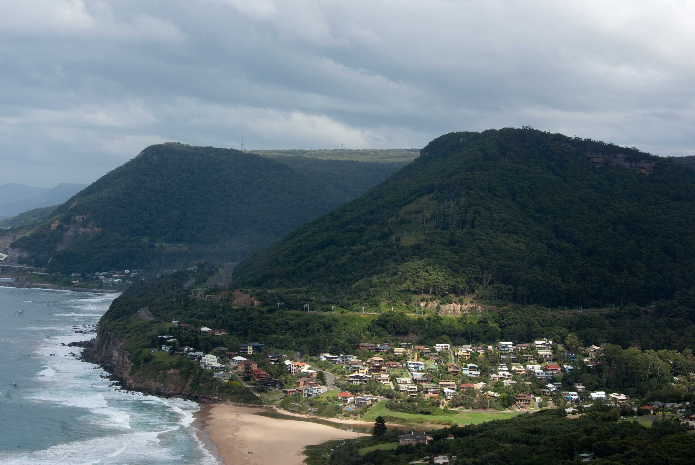
Đây là khu phố tao sống, gần ga tàu.
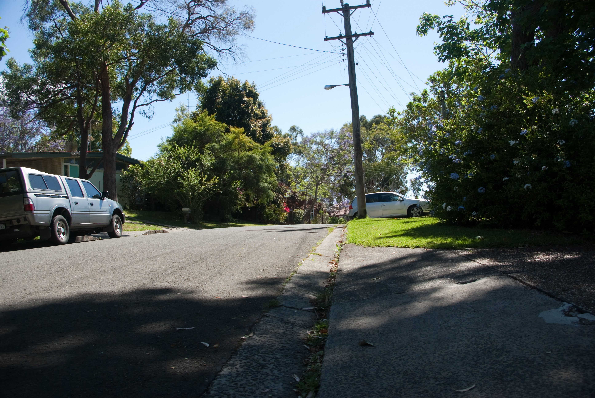
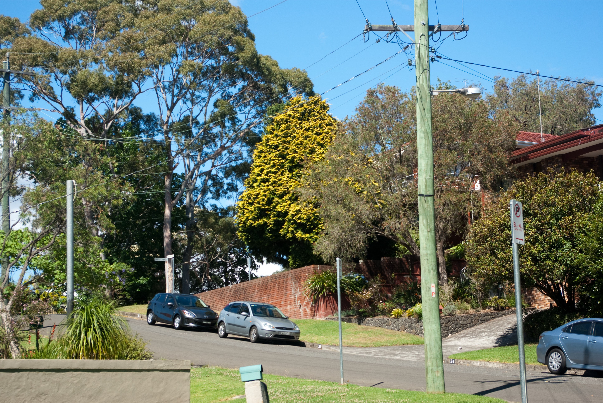

Còn đây là cái ga xép buồn tịch liêu
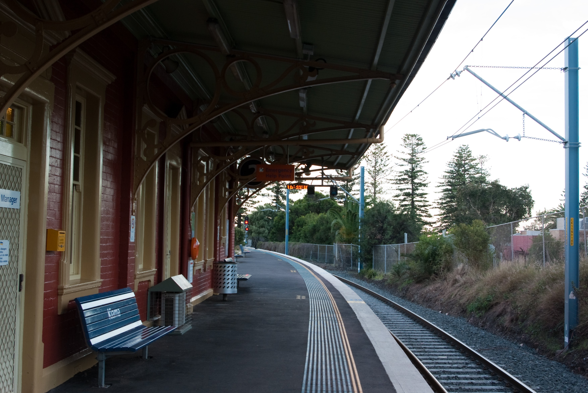

Nhưng cũng ko buồn lâu, khi sau này tao có bạn đợi tàu cùng, nói chuyện rôm lắm, em nó người Nauy, cũng du học sinh, nhỏ nhắn xinh xắn. Tao định la liếm mà sau biết nó là les nên thôi.
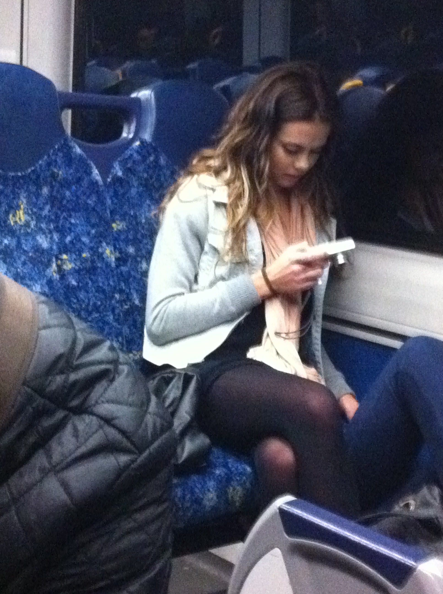

Chỗ tao nó gần rừng quốc gia nên thú đéo thiếu. Thú đủ loại, cả Koala, Kangaru, bò sát, chim mòng biển... tụi nào vào vườn nhà, ra công viên, vào bếp lấy đồ ăn tự nhiên như ruồi. Ah, rắn ở đây thì tao chưa gặp, hỏi chủ nhà nó bảo chưa đến mùa chúng nó ra quẩy thôi, nghe vậy tao ở được đúng 1 tháng là té.
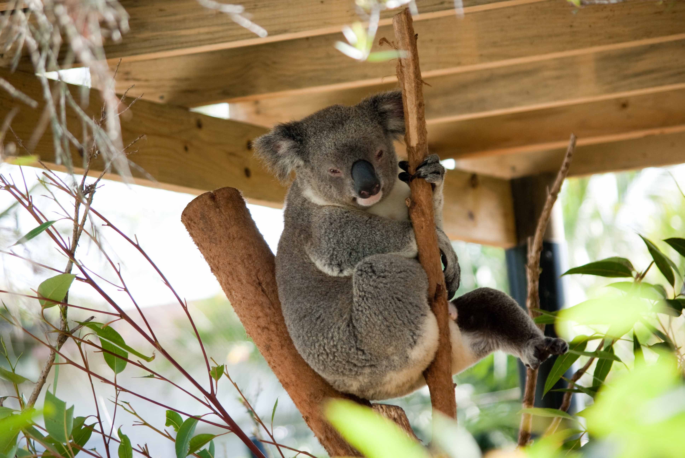
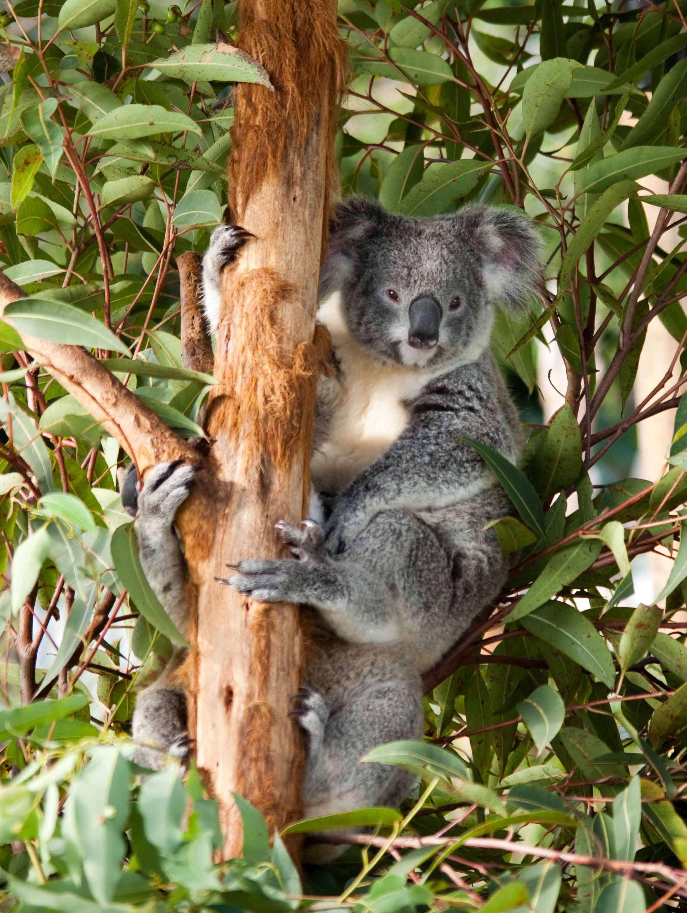
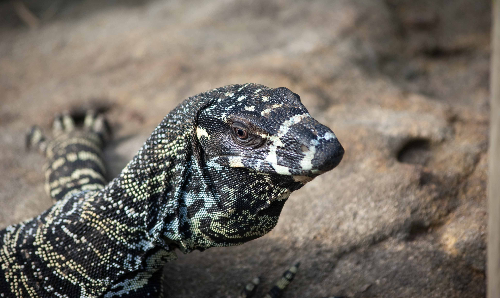
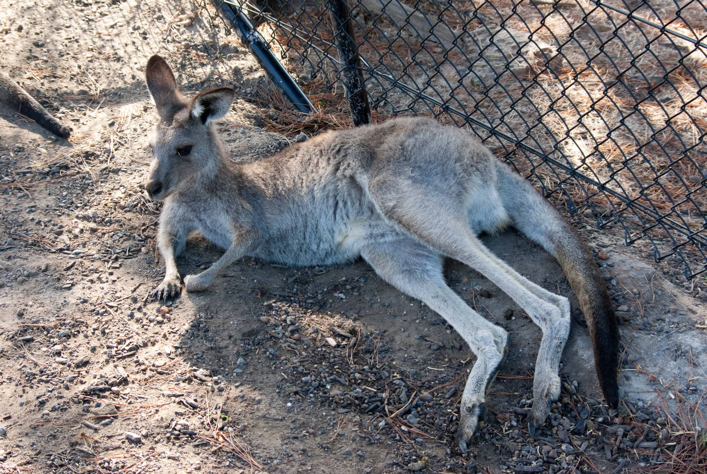
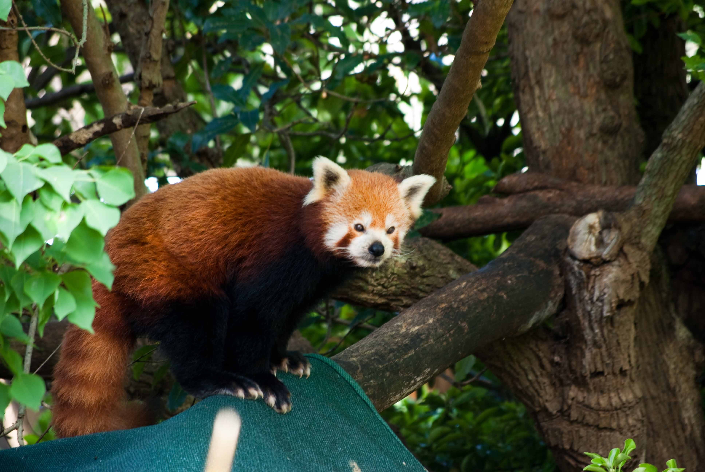
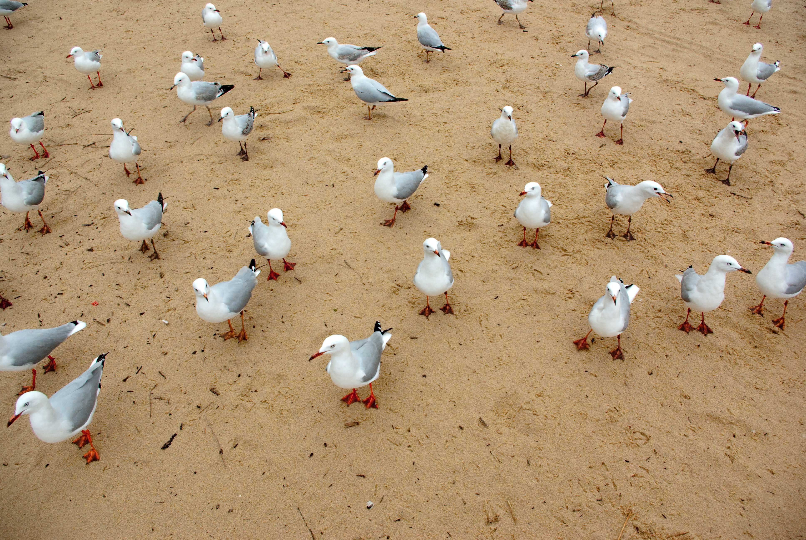

Cứ chiều chiều tao trèo lên chỗ này trông ra biển, nhớ về quê mẹ ruột đau vl.
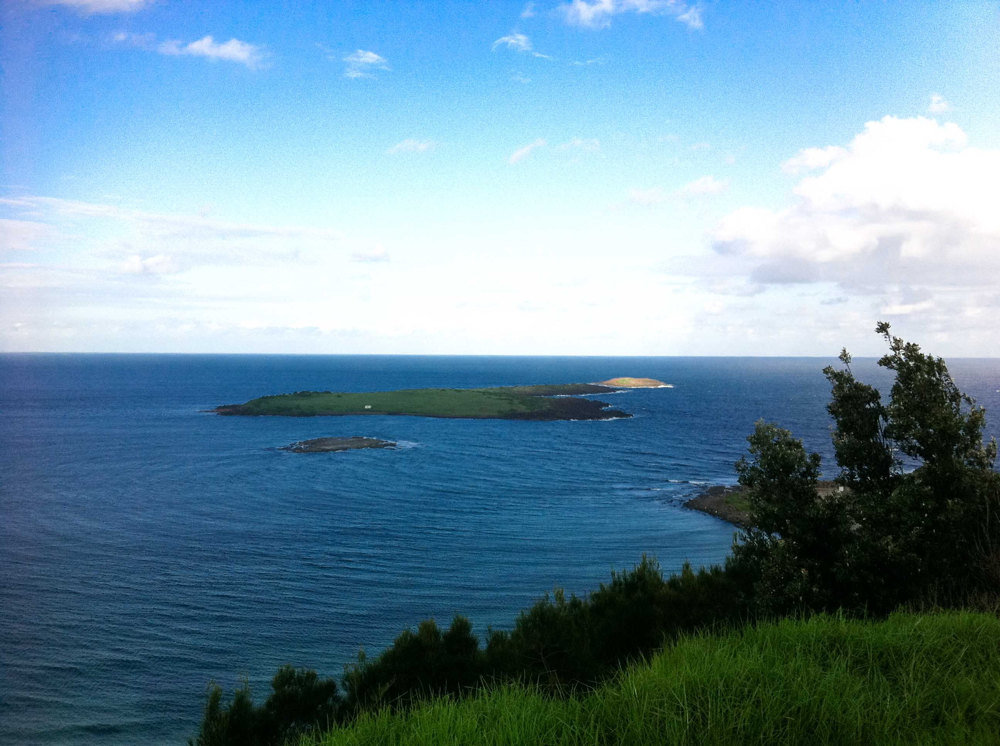

Cho đến mãi hơn tuần sau, khi tao lên đây thì gặp em Singapor du học sinh cũng đang ngồi nhìn biển xa xăm, thế là đời tao lên hương. Chỉ có thể gọi là tình viễn xứ ngọt ngào và man trá. Một thiên tình sử đầy ngọt ngào và nhục dục. Thôi tao đéo kể chi tiết ko mấy thằng Voz chim chỉ để đái lại bảo tao natuan.
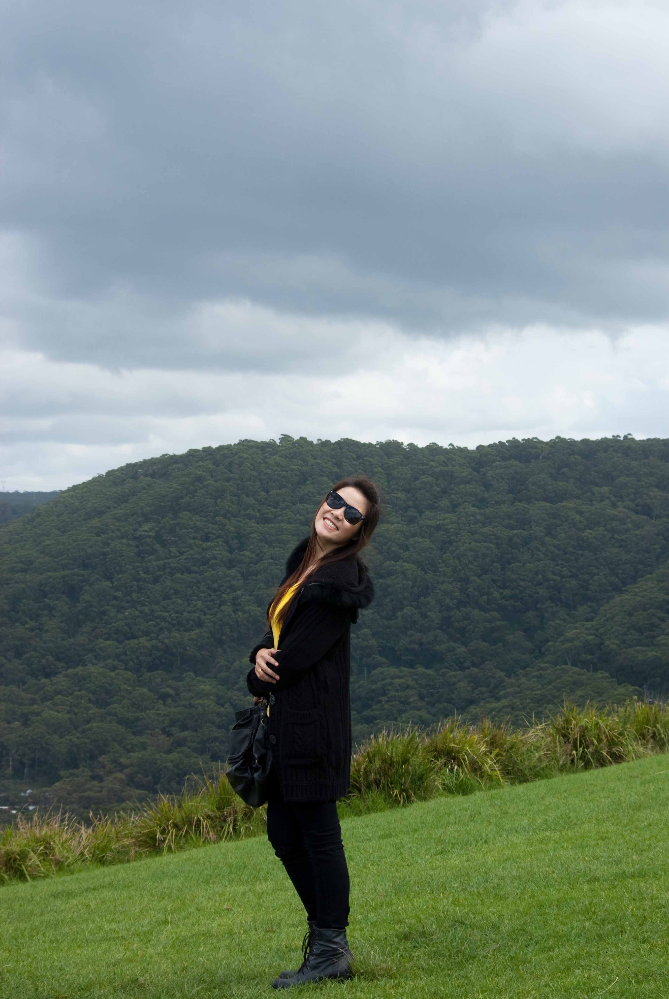
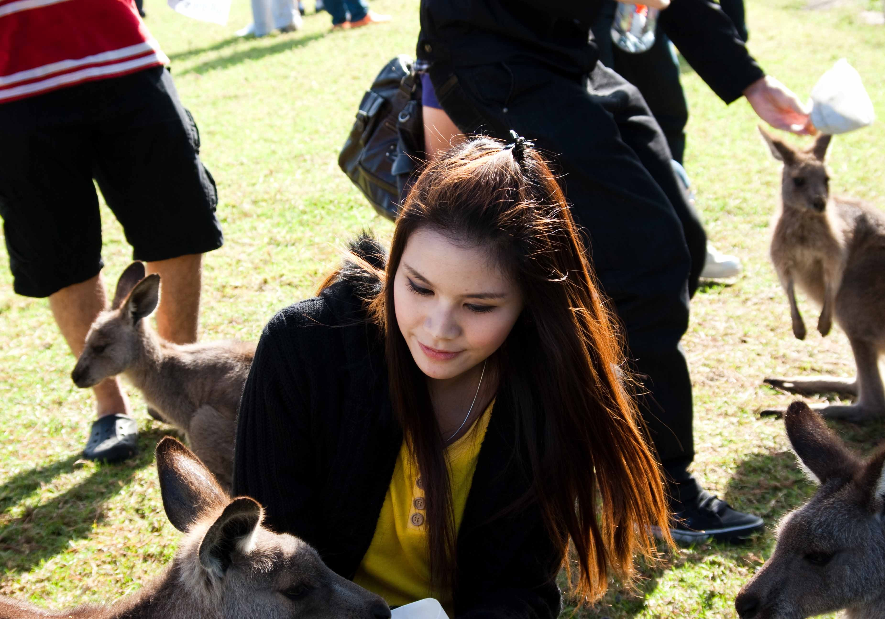

Tuần O-W tao đến 1 buổi cho xong thủ tục là tao đéo đến nữa, toàn chơi ba cái trò trẻ con. Tao ở nhà và dành thời gian khám phá núi rừng. Cuối đường nhà tao là con đường vào rừng, hình như cho xe chữa cháy khi cần.
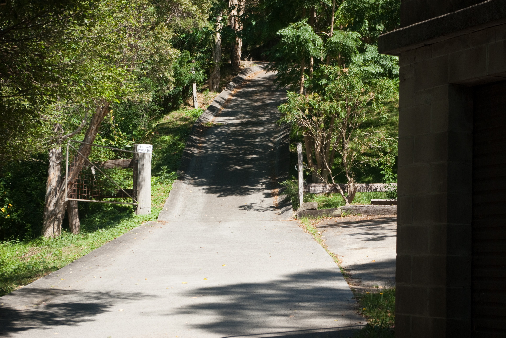

Nói chung vào rừng 1 mình ở Úc cũng là trải nghiệm ghê răng phết. Hẹn chúng mày khi nào tao rảnh sẽ kể tiếp. Chào thân ái và dí dái vào thằng nào bảo tao natuan nữa.
